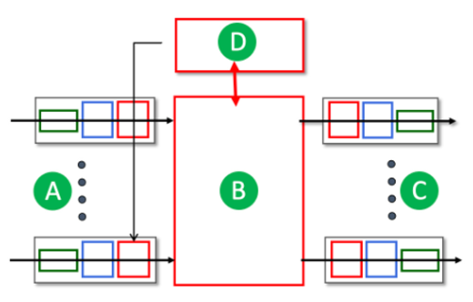
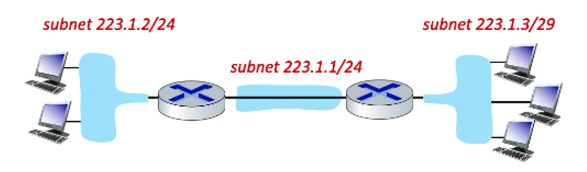
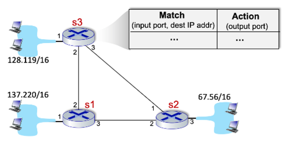
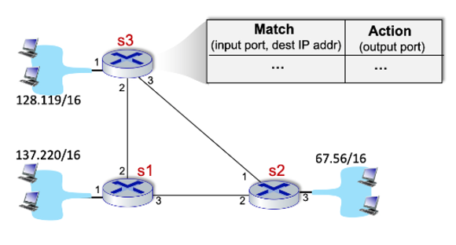
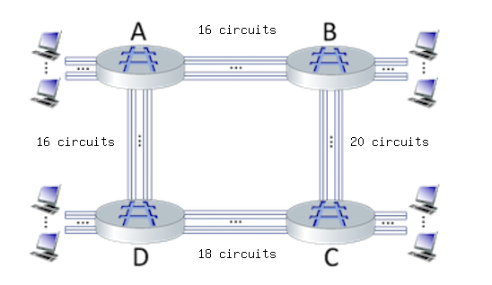
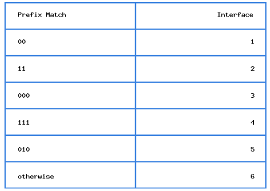

# Problem Set for Computer Networking: A Top-Down Approach, 7th Edition
**Source** : [https://gaia.cs.umass.edu/kurose\_ross/knowledgechecks/index.php](https://gaia.cs.umass.edu/kurose_ross/knowledgechecks/index.php)</br>
**Suggestion** : Use light mode for better view of PNG files

# Table of contents

- [KNOWLEDGE CHECKS](#knowledge-checks)</br>
  - [CHAPTER 1: INTRODUCTION](#chapter-1-introduction)
    - [What is the Internet? ](#what-is-the-internet)
    - [The Network Edge ](#the-network-edge)
    - [The Network Core ](#the-network-core)
    - [Performance: Delay, Loss and Throughput in Computer Networks ](#performance-delay-loss-and-throughput-in-computer-networks)
    - [Protocol layers and Their Service Models](#protocol-layers-and-their-service-models)
    - [Networks under attack](#networks-under-attack)
    - [History of Computer Networking](#history-of-computer-networking)</br></br>
  - [CHAPTER 2: APPLICATION LAYER](#chapter-2-application-layer)
    - [Principles of Network Applications ](#principles-of-network-applications)
    - [The Web and HTTP ](#the-web-and-http)
    - [Email ](#email)
    - [The Domain Name Service: DNS ](#the-domain-name-service-dns)
    - [Video Streaming and Content Distribution Networks ](#video-streaming-and-content-distribution-networks)
    - [Socket Programming: Creating Network Applications ](#socket-programming-creating-network-applications)</br></br>
  - [CHAPTER 3: TRANSPORT LAYER](#chapter-3-transport-layer)
    - [Introduction and Transport-Layer Services](#introduction-and-transport-layer-services)
    - [Multiplexing and Demultiplexing](#multiplexing-and-demultiplexing)
    - [Connectionless Transport: UDP](#connectionless-transport-udp)
    - [Principles of Reliable Data Transfer](#principles-of-reliable-data-transfer)
    - [Connection-Oriented Transport: TCP](#connection-oriented-transport-tcp)
    - [Principles of Congestion Control](#principles-of-congestion-control)
    - [TCP Congestion Control](#tcp-congestion-control)
    - [Evolution of Transport Layer Functionality](#evolution-of-transport-layer-functionality)</br></br>
  - [CHAPTER 4: NETWORK LAYER: DATA PLANE](#chapter-4-network-layer-data-plane)
    - [Network Layer Overview](#network-layer-overview)
    - [Whats Inside a Router?](#whats-inside-a-router)
    - [The Internet Protocol](#the-internet-protocol)
    - [Generalized Forwarding](#generalized-forwarding)
    - [Middleboxes and Summary](#middleboxes-and-summary)</br></br>

- [INTERACTIVE IMPLEMENTATION](#interactive-implementation)</br>
  - [CHAPTER 1: INTRODUCTION](#chapter-1-introduction-1)
    - [Circuit Switching](#circuit-switching)
    - [Quantitative Comparison of Packet Switching and Circuit Switching](#quantitative-comparison-of-packet-switching-and-circuit-switching)
    - [Car - Caravan Analogy](#car---caravan-analogy)
    - [One-hop Transmission Delay](#one-hop-transmission-delay)
    - [Queuing Delay](#queuing-delay)
    - [End-to-End Delay](#end-to-end-delay)
    - [End-to-End Throughput](#end-to-end-throughput)
    - [The IP Stack and Protocol Layering](#the-ip-stack-and-protocol-layering)</br></br>
  - [CHAPTER 2: APPLICATION LAYER](#chapter-2-application-layer-1)
    - [DNS - Basics](#dns---basics)
    - [DNS - Iterative vs Recursive Query](#dns---iterative-vs-recursive-query)
    - [DNS and HTTP delays](#dns-and-http-delays)
    - [HTTP GET](#http-get)
    - [HTTP RESPONSE](#http-response)
    - [Browser Caching](#browser-caching)
    - [Electronic Mail and SMTP](#electronic-mail-and-smtp)
    - [A comparison of client-server and P2P file distribution delays](#a-comparison-of-client-server-and-p2p-file-distribution-delays)</br></br>
  - [CHAPTER 3: TRANSPORT LAYER](#chapter-3-transport-layer-1)
    - [Internet checksum](#internet-checksum)
    - [Reliable data transfer: rdt22](#reliable-data-transfer-rdt22)
    - [Reliable data transfer: rdt30](#reliable-data-transfer-rdt30)
    - [TCP sequence and ACK numbers, with segment loss](#tcp-sequence-and-ack-numbers-with-segment-loss)
    - [TCP RTT and timeout](#tcp-rtt-and-timeout)
    - [TCP congestion window evolution](#tcp-congestion-window-evolution)
    - [TCP retransmissions](#tcp-retransmissions)
    - [UDP Mux and Demux](#udp-mux-and-demux)
    - [TCP Mux and Demux](#tcp-mux-and-demux)</br></br>
  - [CHAPTER 4: NETWORK LAYER: DATA PLANE](#chapter-4-network-layer-data-plane-1)
    - [Longest Prefix Matching](#longest-prefix-matching)
    - [Packet Scheduling](#packet-scheduling)
    - [Subnet Addressing](#subnet-addressing)
    - [Network Address Translation](#network-address-translation)
    - [IPv6 Tunneling and Encapsulation](#ipv6-tunneling-and-encapsulation)
    - [Openflow Flow Tables](#openflow-flow-tables)</br></br>
  - [CHAPTER 5: NETWORK LAYER: CONTROL PLANE](#chapter-5-network-layer-control-plane)
    - [Dijkstra's Link State Algorithm](#dijkstras-link-state-algorithm)
    - [Dijkstra's Link State Algorithm - Advanced](#dijkstras-link-state-algorithm---advanced)
    - [Bellman Ford Distance Vector algorithm](#bellman-ford-distance-vector-algorithm)</br></br>
  - [CHAPTER 6: LINK LAYER](#chapter-6-link-layer)
    - [Error Detection and Correction: Two Dimensional Parity](#error-detection-and-correction-two-dimensional-parity)
    - [Error Detection and Correction: Cyclic Redundancy Check](#error-detection-and-correction-cyclic-redundancy-check)
    - [Random Access Protocols: Aloha](#random-access-protocols-aloha)
    - [Multiple Access Protocols: Collisions](#multiple-access-protocols-collisions)
    - [Link Layer (and network layer) addressing, forwarding](#link-layer-and-network-layer-addressing-and-forwarding)
    - [Learning Switches - Basic](#learning-switches---basic)
    - [Learning Switches - Advanced](#learning-switches---advanced)

# Knowledge Checks

## CHAPTER 1: INTRODUCTION

### What is the Internet? [](https://gaia.cs.umass.edu/kurose_ross/knowledgechecks/index.php#)

1. The following descriptions correspond to a "nuts-and-bolts" view of the Internet:
    1. A "network of networks".
    2. A collection of billions of computing devices, and packet switches interconnected by links.
    3. A collection of hardware and software components executing protocols that define the format and the order of messages exchanged between two or more communicating entities, as well as the actions taken on the transmission and/or receipt of a message or other event.
2. The following descriptions correspond to a "services" view of the Internet:
    1. A platform for building network applications.
    2. A place I go for information, entertainment, and to communicate with people.
3. The following human scenarios involve a protocol:
    1. A student raising her/his hand to ask a really insightful question, followed by the teacher acknowledging the student, listening carefully to the question, and responding with a clear, insightful answer. And then thanking the student for the question, since teachers love to get questions.
    2. One person asking, and getting, the time to/from another person.
    3. Two people introducing themselves to each other.

### The Network Edge [](https://gaia.cs.umass.edu/kurose_ross/knowledgechecks/index.php#)

1. Ethernet : Wired. Up to 100's Gbps per link.
    
    802.11 WiFi : Wireless. 10's to 100's of Mbps per device
    
    Cable access network : Wired. Up to 10's to 100's of Mbps downstream per user
    
    Digital Subscriber Line : Wired. Up to 10's of Mbps downstream per user
    
    4G cellular LTE : Wireless. Up to 10's Mbps per device.
    
2. Which of the following physical layer technologies has the highest transmission rate *and* lowest bit error rate in practice?
    
    Fiber optic cable
    

### The Network Core [](https://gaia.cs.umass.edu/kurose_ross/knowledgechecks/index.php#)

1. Choose one the following two definitions that makes the correct distinction between routing versus forwarding.
    
    **Forwarding** is the local action of moving arriving packets from router’s input link to appropriate router output link, while **routing** is the global action of determining the source-destination paths taken by packets.
    
2. Which of the characteristics below are associated with the technique of *packet switching*? Select all correct answers. [Hint: more than one of the answers is correct].
    - This technique is used in the Internet.
    - Data may be queued before being transmitted due to other user's data that's also queueing for transmission.
    - Congestion loss and variable end-end delays are possible with this technique.
    - Resources are used on demand, not reserved in advance.
3. Which of the characteristics below are associated with the technique of *circuit switching*? Select all correct answers. [Hint: more than one of the answers is correct].
    - This technique was the basis for the telephone call switching during the 20th century and into the beginning of this current century.
    - Reserves resources needed for a call from source to destination.
    - Frequency Division Multiplexing (FDM) and Time Division Multiplexing (TDM) are two approaches for implementing this technique.
4. Consider the circuit-switched network shown in the figure below, with four circuit switches A, B, C, and D. Suppose there are 20 circuits between A and B, 19 circuits between B and C, 15 circuits between C and D, and 16 circuits between D and A. 
    
    What is the maximum number of connections that can be ongoing in the network at any one time?[Note: you can find more questions like this one here.
    
    
    
    70
    
5. Perform a traceroute from your computer (on whatever network you happen to be on) to gaia.cs.umass.edu. Use traceroute (on Mac terminal) or tracert (on Windows command line) or tracepath (on a Linux command line). Enter the missing part of the name of the router just before the host gaia.cs.umass.edu is reached:
    
    ??.cs.umass.edu
    
    Note: Routing may change, so the answer here may not be correct anymore. Also, if you are a Verizon user, there are known problems using traceroute with Verizon - if traceroute shows you two hops only to gaia.cs.umass.edu or any destination, skip this question.
    
    nscs1bbs1
    
6. When we say that the Internet is a "network of networks," we mean? Check all that apply (hint: check two or more).
    - The Internet is made up of a lot of different networks that are interconnected to each other.
    - The Internet is made up of access networks at the edge, tier-1 networks at the core, and interconnected regional and content provider networks as well.
7. Consider a scenario in which 5 users are being multiplexed over a channel of 10 Mbps. Under the various scenarios below, match the scenario to whether circuit switching or packet switching is better.
    - Each user generates traffic at an average rate of 2.1 Mbps, generating traffic at a rate of 15 Mbps when transmitting: Neither works well in this overload scenario
    - Each user generates traffic at an average rate of 2 Mbps, generating traffic at a rate of 2 Mbps when transmitting.: Circuit switching
    - Each user generates traffic at an average rate of 0.21 Mbps, generating traffic at a rate of 15 Mbps when transmitting.: Packet switching

### Performance: Delay, Loss and Throughput in Computer Networks [](https://gaia.cs.umass.edu/kurose_ross/knowledgechecks/index.php#)

1. Match the description of each component of packet delay to its name in the pull down list.
    - Time needed to perform an integrity check, lookup packet information in a local table and move the packet from an input link to an output link in a router.: Processing delay
    - Time spent waiting in packet buffers for link transmission.: Queueing delay
    - Time spent transmitting packets bits into the link.: Transmission delay
    - Time need for bits to physically propagate through the transmission medium from end one of a link to the other.: Propagation delay
2. Suppose a packet is *L* = 1500 bytes long (one byte = 8 bits), and link transmits at R = 1 Gbps (i.e., a link can transmit bits 1,000,000,000 bits per second). What is the transmission delay for this packet? [Note: you can find more problems like this one here.]
    
    
    
    .000012 secs
    
3. Suppose a packet is *L* = 1200 bytes long (one byte = 8 bits), and link transmits at R = 100 Mbps (i.e., a link can transmit bits 100,000,000 bits per second). What is the transmission delay for this packet? [Note: you can find more problems like this one here.]
    
    .000096 secs
    
4. Consider the network shown in the figure below, with three links, each with the specified transmission rate and link length. Assume the length of a packet is 8000 bits.What is the transmission delay at link 2? [Note: you can find more problems like this one here.]
    
    
    
    8 x 10^(-5) secs
    
5. Consider the network shown in the figure below, with three links, each with the specified transmission rate and link length. Assume the length of a packet is 8000 bits. The speed of light propagation delay on each link is 3x10^8 m/secWhat is the propagation delay at (along) link 2?
    
    .0033 secs
    
6. What is the maximum throughput achievable between sender and receiver in the scenario shown below?
    
    
    
    1.5 Mbps
    
7. Consider the scenario shown below, with four different servers connected to four different clients over four three-hop paths. The four pairs share a common middle hop with a transmission capacity of R = 300 Mbps. The four links from the servers to the shared link have a transmission capacity of RS = 50 Mbps. Each of the four links from the shared middle link to a client has a transmission capacity of RC = 90 Mbps.What is the maximum achievable end-end throughput (an integer value, in Mbps) for each of four client-to-server pairs, assuming that the middle link is fairly shared (divides its transmission rate equally) and all servers are trying to send at their maximum rate?Your answer: [A] Mbps
    
    
    
    50
    
8. Consider the scenario shown below, with four different servers connected to four different clients over four three-hop paths. The four pairs share a common middle hop with a transmission capacity of R = 300 Mbps. The four links from the servers to the shared link have a transmission capacity of RS = 50 Mbps. Each of the four links from the shared middle link to a client has a transmission capacity of RC = 90 Mbps.
    
    Assuming that the servers are all sending at their maximum rate possible, what are the link utilizations for the server links (with transmission capacity RS)? Enter your answer in a decimal form of 1.00 (if the utilization is 1) or 0.xx (if the utilization is less than 1, rounded to the closest xx).Your answer: The utilization of the server links is: [A]
    
    1.00
    
9. Consider the scenario shown below, with four different servers connected to four different clients over four three-hop paths. The four pairs share a common middle hop with a transmission capacity of R = 300 Mbps. The four links from the servers to the shared link have a transmission capacity of RS = 50 Mbps. Each of the four links from the shared middle link to a client has a transmission capacity of RC = 90 Mbps.
    
    Assuming that the servers are all sending at their maximum rate possible, what are the link utilizations of the shared link (with transmission capacity R)? Enter your answer in a decimal form of 1.00 (if the utilization is 1) or 0.xx (if the utilization is less than 1, rounded to the closest xx).Your answer: The utilization of shared link is: [A]
    
    0.67
    
10. Consider the scenario shown below, with four different servers connected to four different clients over four three-hop paths. The four pairs share a common middle hop with a transmission capacity of R = 300 Mbps. The four links from the servers to the shared link have a transmission capacity of RS = 50 Mbps. Each of the four links from the shared middle link to a client has a transmission capacity of RC = 90 Mbps.
    
    Assuming that the servers are all sending at their maximum rate possible, what are the link utilizations of the client links (with transmission capacity RC)? Enter your answer in a decimal form of 1.00 (if the utilization is 1) or 0.xx (if the utilization is less than 1, rounded to the closest xx).Your answer: The utilization of client link is: [A]
    
    0.56
    

### Protocol layers and Their Service Models

1. Match the function of a layer in the Internet protocol stack to its its name in the pulldown menu.
    - Protocols that are part of a distributed network application.: Application Layer
    - Transfer of data between one process and another process (typically on different hosts).: Transport layer
    - Delivery of datagrams from a source host to a destination host (typically).: Network layer
    - Transfer of data between neighboring network devices.: Link layer
    - Transfer of a bit into and out of a transmission media.: Physical layer
2. Match the name of an Internet layer with unit of data that is exchanged among protocol entities at that layer, using the pulldown menu.
    - Application layer: Message
    - Transport layer: Segment
    - Network layer: Datagram
    - Link layer: Frame
    - Physical layer: Bit
3. Consider the figure below, showing a link-layer frame heading from a host to a router. There are three header fields shown. Match the name of a header with a header label shown in the figure.
    
    
    
    - Header H1: Link layer
    - Header H2: Network Layer
    - Header H3: Transport layer
4. Which of the definitions below describe what is meant by the term "encapsulation"?
    
    Taking data from the layer above, adding header fields appropriate for this layer, and then placing the data in the payload field of the "packet" for that layer.
    

### Networks under attack

1. Match the description of a security defense with its name.
    - Specialized "middleboxes" filtering or blocking traffic, inspecting packet contents inspections: Firewall
    - Provides confidentiality by encoding contents: Encryption
    - Used to detect tampering/changing of message contents, and to identify the originator of a message.: Digital Signatures
    - Limiting use of resources or capabilities to given users.: Access Control
    - Proving you are who you say you are.: Authentication

### History of Computer Networking

1. Match the networking event with the time frame when the event occurred.
    - Early studies of packet switching by Baran, Davies, Kleinrock.: Early 1960's
    - First ARPAnet node operational.: Late 1960's
    - Internetting: DARPA researchers connect three networks together.: 1970's
    - The Internet Protocol (IP) is standardized in RFC 791.: Early 1980's
    - Congestion control is added to the TCP protocol.: Late 1980's
    - The WWW starts up (note: the WWW design started at the end of previous decade).: 1990's
    - Software-defined networking begins.: 2000-2010
    - The number wireless Internet-connected devices surpasses the number of connected wired devices.: 2010 - 2020

## CHAPTER 2: APPLICATION LAYER

### Principles of Network Applications [](https://gaia.cs.umass.edu/kurose_ross/knowledgechecks/index.php#)

1. Which of the characteristics below are associated with a client-server approach to structuring network applications (as opposed to a P2P approach)?
    - There is a server that is always on.
    - HTTP uses this application structure.
    - There is a server with a well known server IP address.
2. Which of the characteristics below are associated with a P2P approach to structuring network applications (as opposed to a clienht-server approach)?
    - There is *not* a server that is always on.
    - A process requests service from those it contacts and will provide service to processes that contact it.
3. When an application uses a UDP socket, what transport services are provided to the application by UDP? Check all that apply.
    - *Best effort service.* The service will make a best effort to deliver data to the destination but makes no guarantees that any particular segment of data will actually get there.
4. When an application uses a TCP socket, what transport services are provided to the application by TCP? Check all that apply.
    - *Loss-free data transfer.* The service will reliably transfer all data to the receiver, recovering from packets dropped in the network due to router buffer overflow.
    - *Congestion control.* The service will control senders so that the senders do not collectively send more data than links in the network can handle.
    - *Flow Control.* The provided service will ensure that the sender does not send so fast as to overflow receiver buffers.

### The Web and HTTP [](https://gaia.cs.umass.edu/kurose_ross/knowledgechecks/index.php#)

1. What do we mean when we say "HTTP is stateless"? In answering this question, assume that cookies are not used. Check all answers that apply.
    - An HTTP *server* does not remember anything about what happened during earlier steps in interacting with this HTTP client.
2. What is an HTTP cookie used for?
    
    A cookie is a code used by a server, carried on a client’s HTTP request, to access information the server had earlier stored about an earlier interaction with this Web *browser*. [Think about the distinction between a *browser* and a *person*.]
    
3. What is the purpose of the HTTP GET message?
    
    The HTTP GET request message is used by a web client to request a web server to send the requested object from the server to the client.
    
4. What is the purpose of the conditional HTTP GET request message?
    
    To allow a server to only send the requested object to the client if this object has changed since the server last sent this object to the client.
    
5. Suppose a client is sending an HTTP GET request message to a web server, gaia.cs.umass.edu. Suppose the client-to-server HTTP GET message is the following:
    
    ```cpp
    GET /kurose_ross_sandbox/interactive/quotation2.htm HTTP/1.1
    Host: gaia.cs.umass.edu
    Accept: text/plain, text/html, text/xml, image/jpeg, image/gif, audio/mpeg, audio/mp4, video/wmv, video/mp4,
    Accept-Language: en-us, en-gb;q=0.1, en;q=0.7, fr, fr-ch, da, de, fi
    If-Modified-Since: Wed, 09 Sep 2020 16:06:01 -0700
    User Agent: Mozilla/5.0 (Windows NT 6.1; WOW64) AppleWebKit/535.11 (KHTML, like Gecko) Chrome/17.0.963.56 Safari/535.11
    What version of HTTP is the client using?
    ```
    
    1.1
    
6. Again, suppose a client is sending an HTTP GET request message to a web server, gaia.cs.umass.edu. The client-to-server HTTP GET message is the following 
    
    What is the language in which the client would least prefer to get a response? [You may have to search around the Web a bit to answer this.]
    
    United Kingdom English
    
7. Again, suppose a client is sending an HTTP GET request message to a web server, gaia.cs.umass.edu. Suppose the client-to-server HTTP GET message is the following (same as in previous problem)
    
    Does the client have a cached copy of the object being requested?[Note: you can find additional questions similar to this here.]
    
    Yes, because this is a conditional GET, as evidenced by the If-Modified-Since field.
    
8. Suppose now the server sends the following HTTP response message the client:
    
    ```cpp
    HTTP/1.0 200 OK
    Date: Wed, 09 Sep 2020 23:46:21 +0000
    Server: Apache/2.2.3 (CentOS)
    Last-Modified: Wed, 09 Sep 2020 23:51:41 +0000
    ETag:17dc6-a5c-bf716880.
    Content-Length: 418
    Connection: Close
    Content-type: image/html
    ```
    
    Will the web server close the TCP connection after sending this message?[Note: you can find more questions like this one here.]
    
    Yes, the server will close this connection because version 1.0 of HTTP is being used, and TCP connections do not stay open persistently.
    
9. Which of the following are advantages of using a web cache? Sselect one or more answers.
    - Caching uses less bandwidth coming into an institutional network where the client is located, if the cache is also located in that institutional network.
    - Caching generally provides for a faster page load time at the client, if the web cache is in the client's institutional network, because the page is loaded from the nearby cache rather than from the distant server.
10. Which of the following are changes between HTTP 1.1 and HTTP/2? Note: select one or more answers.
    - HTTP/2 allows a large object to be broken down into smaller pieces, and the transmission of those pieces to be interleaved with transmission other smaller objects, thus preventing a large object from forcing many smaller objects to wait their turn for transmission.
    - HTTP/2 allows objects in a persistent connection to be sent in a client-specified priority order.
11. Which of the following pieces of information will appear in a server's application-level HTTP reply message? (Check all that apply.)
    - A response code
    - A response phrase associated with a response code
12. What is the purpose of the *If-Modified-Since* field in a HTTP GET request message
    
    To indicate to the server that the client has cached this object from a previous GET, and the time it was cached.
    
13. What is the purpose of a cookie value in the HTTP GET request?
    
    The cookie value itself doesn't mean anything. It is just a value that was returned by a web server to this client during an earlier interaction.
    
14. Suppose a client is sending an HTTP GET message to a web server, gaia.cs.umass.edu. Suppose the client-to-server HTTP GET message is the following:
    
    ```cpp
    GET /kurose_ross_sandbox/interactive/quotation2.htm HTTP/1.1
    Host: gaia.cs.umass.edu
    Accept: text/plain, text/html, text/xml, image/jpeg, image/gif, audio/mpeg, audio/mp4, video/wmv, video/mp4,
    Accept-Language: en-us, en-gb;q=0.1, en;q=0.7, fr, fr-ch, da, de, fi
    If-Modified-Since: Wed, 09 Sep 2020 16:06:01 -0700
    User Agent: Mozilla/5.0 (Windows NT 6.1; WOW64) AppleWebKit/535.11 (KHTML, like Gecko) Chrome/17.0.963.56 Safari/535.11Does the client have a cached copy of the object being requested?
    ```
    
    Yes, because this is a conditional GET.
    
15. Suppose an HTTP server sends the following HTTP response message a client:
    
    ```cpp
    HTTP/1.0 200 OK
    Date: Wed, 09 Sep 2020 23:46:21 +0000
    Server: Apache/2.2.3 (CentOS)
    Last-Modified: Wed, 09 Sep 2020 23:51:41 +0000
    ETag:17dc6-a5c-bf716880.
    Content-Length: 418
    Connection: Close
    Content-type: image/html
    ```
    
    Will the web server close the TCP connection after sending this message?
    
    Yes, because this is HTTP 1.0
    

### Email [](https://gaia.cs.umass.edu/kurose_ross/knowledgechecks/index.php#)

1. How many RTTs are there from when a client first contacts an email server (by initiating a TCP session) to when the client can begin sending the email message itself - that is following all initial TCP or SMTP handshaking required?Recall the figure below from our class notes:
    
    
    
    3
    
2. Which of the following characteristics apply to HTTP only (and do *not* apply to SMTP)? Note: check one or more of the characteristics below.
    - Uses a blank line (CRLF) to indicate end of request header.
    - Operates mostly as a "client pull" protocol.
    - Uses server port 80.
3. Which of the following characteristics apply to SMTP only (and do *not* apply to HTTP)? Note: check one or more of the characteristics below.
    - Uses CRLF.
    - CRLF to indicate end of message.
    - Operates mostly as a "client push" protocol.
    - Uses server port 25.
4. Which of the following characteristics apply to both HTTP and SMTP? Note: check one or more of the characteristics below.
    - Is able to use a persistent TCP connection to transfer multiple objects.
    - Has ASCII command/response interaction, status codes.
5. Match the functionality of a protocol with the name of a the email protocol (if any) that implements that functionality.
    - Pushes email from a mail client to a mail server.:SMTP
    - Pulls mail from one mail server to another mail server.: Neither
    - Pulls email to a mail client from a mail server.: IMAP

### The Domain Name Service: DNS [](https://gaia.cs.umass.edu/kurose_ross/knowledgechecks/index.php#)

1. Provides authoritative hostname to IP mappings for organization’s named hosts.
    - Provides authoritative hostname to IP mappings for organization's named hosts.: Authoritative DNS server
    - Replies to DNS query by local host, by contacting other DNS servers to answer the query.: Local DNS server
    - Responsible for a domain (e.g., **.com,** .edu); knows how to contact authoritative name servers.: Top Level Domain (TLD) servers
    - Highest level of the DNS hierarchy, knows how to reach servers responsible for a given domain (e.g., **.com,** .edu).: DNS root servers
2. What is the value of caching in the local DNS name server? Check all that apply.
    - DNS caching provides for faster replies, if the reply to the query is found in the cache.
    - DNS caching results in less load elsewhere in DNS, when the reply to a query is found in the local cache
3. What information does the type "A" resource record hold in the DNS database? Check all that apply.
    
    A hostname and an IP address.
    
4. Suppose that the local DNS server caches all information coming in from all root, TLD, and authoritative DNS servers for 20 time units. (Thus, for example, when a root server returns the name and address of a TLD server for .com, the cache remembers that this is the TLD server to use to resolve a .com name). Assume also that the local cache is initially empty, that iterative DNS queries are always used, that DNS requests are just for name-to-IP-address translation, that 1 time unit is needed for each server-to-server or host-to-server (one way) request or response, and that there is only one authoritative name server (each) for any .edu or .com domain.
    
    
    
    Consider the following DNS requests, made by the local host at the given times:
    
    - *t=0,* the local host requests that the name gaia.cs.umass.edu be resolved to an IP address.
    - *t=1,* the local host requests that the name icann.org be resolved to an IP address.
    - *t=5,* the local host requests that the name cs.umd.edu be resolved to an IP address. (Hint: be careful!)
    - *t=10,* the local host *again* requests that the name gaia.cs.umass.edu be resolved to an IP address.
    - *t=12*, the local host requests that the name cs.mit.edu be resolved to an IP address.
    - *t=30,* the local host *again* requests that the name gaia.cs.umass.edu be resolved to an IP address. (Hint: be careful!)
    
    Which of the requests require 8 time units to be resolved?
    
    - The request at *t=0*.
    - The request at *t=1.*
    - The request at *t=30*.
5. [This question is the same as an earlier question, except for the question statement at the very end.] Suppose that the local DNS server caches all information coming in from all root, TLD, and authoritative DNS servers for 20 time units. (Thus, for example, when a root server returns the name and address of a TLD server for .com, the cache remembers that this is the TLD server to use to resolve a .com name). Assume also that the local cache is initially empty, that iterative DNS queries are always used, that DNS requests are just for name-to-IP-address translation, that 1 time unit is needed for each server-to-server or host-to-server (one way) request or response, and that there is only one authoritative name server (each) for any .edu or .com domain.
    
    Consider the following DNS requests, made by the local host at the given times:
    
    - *t=0,* the local host requests that the name gaia.cs.umass.edu be resolved to an IP address.
    - *t=1,* the local host requests that the name icann.org be resolved to an IP address.
    - *t=5,* the local host requests that the name cs.umd.edu be resolved to an IP address. (Hint: be careful!)
    - *t=10,* the local host *again* requests that the name gaia.cs.umass.edu be resolved to an IP address.
    - *t=12*, the local host requests that the name cs.mit.edu be resolved to an IP address.
    - *t=30,* the local host *again* requests that the name gaia.cs.umass.edu be resolved to an IP address. (Hint: be careful!)
    
    Which of the requests require 6 time units to be resolved?
    
    - The request at *t=5*.
    - The request at *t=12*.
6. [This question is the same as an earlier question, except for the question statement at the very end.] Suppose that the local DNS server caches all information coming in from all root, TLD, and authoritative DNS servers for 20 time units. (Thus, for example, when a root server returns the name and address of a TLD server for .com, the cache remembers that this is the TLD server to use to resolve a .com name). Assume also that the local cache is initially empty, that iterative DNS queries are always used, that DNS requests are just for name-to-IP-address translation, that 1 time unit is needed for each server-to-server or host-to-server (one way) request or response, and that there is only one authoritative name server (each) for any .edu or .com domain.
    
    Consider the following DNS requests, made by the local host at the given times:
    
    - *t=0,* the local host requests that the name gaia.cs.umass.edu be resolved to an IP address.
    - *t=1,* the local host requests that the name icann.org be resolved to an IP address.
    - *t=5,* the local host requests that the name cs.umd.edu be resolved to an IP address. (Hint: be careful!)
    - *t=10,* the local host *again* requests that the name gaia.cs.umass.edu be resolved to an IP address.
    - *t=12*, the local host requests that the name cs.mit.edu be resolved to an IP address.
    - *t=30,* the local host *again* requests that the name gaia.cs.umass.edu be resolved to an IP address. (Hint: be careful!)
    
    Which of the requests require 2 time units to be resolved?
    
    - The request at *t=10*.
7. Check all of the phrases below that state a true property of a *local* DNS server.
    - The local DNS server can decrease the name-to-IP-address resolution time experienced by a querying local host over the case when a DNS is resolved via querying into the DNS hierarchy.
    - The local DNS server record for a remote host is sometimes different from that of the authoritative server for that host.
8. What is the role of an authoritative name server in the DNS? (Check all that apply)
    
    It provides the definitive answer to the query with respect to a name in the authoritative name server's domain.
    
9. We learned that in HTTP web browser caching, HTTP local web server caching, and in local DNS caching, that a user benefits (e.g., shorter delays over the case of no caching) from finding a local/nearby copy of a requested item. In which of the following forms of caching does a user benefit from its not only from its own recent requests (and cached replies) *but also from recent requests made from other users*?
    - Local DNS server caching
    - HTTP local web caching

### Video Streaming and Content Distribution Networks [](https://gaia.cs.umass.edu/kurose_ross/knowledgechecks/index.php#)

1. **Manifest file.** What is the purpose of a *manifest file* in a streaming multimedia setting?
    
    To let a client know where it can retrieve different video segments, encoded at different rates
    
2. What approach is taken by a CDN to stream content to hundreds of thousands of simultaneous users?
    
    Store/serve multiple copies of videos at multiple geographically distributed sites.
    
3. Match the definition/function of an element or approach in a networked streaming video system, with its name.
    - A unit of video, each of which may be encoded at multiple different rates, stored in different files.: Chunk
    - A file containing the location and encoding rate of files corresponding to video segments in a video.: Manifest
    - An approach that allows a client to adapt the encoding rate of retrieved video to network congestion conditions.: DASH
    - A CDN approach that stores content in access networks, close to clients.:Enter deep
4. In DASH (Dynamic, Adaptive Streaming over HTTP), a server divides a video file into chunks that ... (pick best completion from below)
    
    ... are stored, each encoded at multiple rates (video quality). The client plays the video chunk-by-chunk, with each chunk requested at encoding rate that fits the available bandwidth at the time.
    

### Socket Programming: Creating Network Applications [](https://gaia.cs.umass.edu/kurose_ross/knowledgechecks/index.php#)

1. Which of the following characteristics below are associated with a UDP socket? Check one or more that apply.
    - the application must explicitly specify the IP destination address and port number for each group of bytes written into a socket
    - data from different clients can be received on the same socket
    - socket(AF_INET, SOCK_DGRAM) creates this type of socket
    - provides unreliable transfer of a groups of bytes ("a datagram"), from client to server
2. Which of the following characteristics below are associated with a TCP socket? Check one or more that apply.
    - socket(AF_INET, SOCK_STREAM) creates this type of socket
    - a server can perform an accept() on this type of socket
    - when contacted, the server will create a new server-side socket to communicate with that client
    - provides reliable, in-order byte-stream transfer (a "pipe"), from client to server
3. How does the networked application running on a server know the client IP address and the port number to reply to in response to a received datagram?
    
    The application code at the server determines client IP address and port # from the initial segment sent by client, and must explicitly specify these values when sending into a socket back to that client.
    
4. Suppose a Web server has *five* ongoing connections that use TCP receiver port 80, and assume there are no other TCP connections (open or being opened or closed) at that server. How many TCP sockets are in use at this server?
    
    6
    
5. What happens when a socket connect() procedure is called/invoked?
    
    This procedure creates a new socket at the client, and connects that socket to the specified server.
    

## CHAPTER 3: TRANSPORT LAYER

### Introduction and Transport-layer Services [](https://gaia.cs.umass.edu/kurose_ross/knowledgechecks/index.php#)

1. Where is transport-layer functionality primarily implemented?
    
    Transport layer functions are implemented primarily at the hosts at the "edge" of the network.
    
2. True or False: The transport layer provides for host-to-host delivery service?
    
    True.
    
3. Check all of the services below that are provided by the TCP protocol.
    - A flow-control service that ensures that a sender will not send at such a high rate so as to overflow receiving host buffers.
    - In-order data delivery
    - Reliable data delivery.
    - A byte stream abstraction, that does not preserve boundaries between message data sent in different socket send calls at the sender.
    - A congestion control service to ensure that multiple senders do not overload network links.
4. Check all of the services below that are provided by the UDP protocol.
    
    A message abstraction, that preserves boundaries between message data sent in different socket send calls at the sender.
    
5. The transport layer sits on top of the network layer, and provides its services using the services provided to it by the network layer. Thus it’s important that we know what is meant by the network layer’s “best effort” delivery service. True or False:
    
    *The network layer’s best-effort delivery service means that IP makes its “best effort” to deliver segments between communicating hosts, but it makes no guarantees. In particular, it does not guarantee segment delivery, it does not guarantee orderly delivery of segments, and it does not guarantee the integrity of the data in the segments.*
    
    Correct! The network layer's best effort service doesn't really provide much service at all, does it?
    

### Multiplexing and Demultiplexing [](https://gaia.cs.umass.edu/kurose_ross/knowledgechecks/index.php#)

1. What is meant by transport-layer demultiplexing?
    
    Receiving a transport-layer segment from the network layer, extracting the payload (data) and delivering the data to the correct socket.
    
2. What is meant by transport-layer multiplexing?
    
    Taking data from one socket (one of possibly many sockets), encapsulating a data chuck with header information - thereby creating a transport layer segment - and eventually passing this segment to the network layer.
    
3. True or False: When multiple UDP clients send UDP segments to the same destination port number at a receiving host, those segments (from different senders) will always be directed to the same socket at the receiving host.
    
    True
    
4. True or False: When multiple TCP clients send TCP segments to the same destination port number at a receiving host, those segments (from different senders) will always be directed to the same socket at the receiving host.
    
    False
    
5. True or False: It is possible for two UDP segments to be sent from the same socket with source port 5723 at a server to two different clients.
    
    True
    
6. True or False: It is possible for two TCP segments with source port 80 to be sent by the sending host to different clients.
    
    True
    

### Connectionless Transport: UDP [](https://gaia.cs.umass.edu/kurose_ross/knowledgechecks/index.php#)

1. True or False: On the sending side, the UDP sender will take each application-layer chunk of data written into a UDP socket and send it in a distinct UDP datagram. And then on the receiving side, UDP will deliver a segment's payload into the appropriate socket, preserving the application-defined message boundary.
    
    True
    
2. Which of the fields below are in a UDP segment header? *[Hint: note the use of the word "header" in this question statement.]*
    - Source port number
    - Length (of UDP header plus payload)
    - Internet checksum
    - Destination port number
3. Why is the UDP header length field needed?
    
    Because the payload section can be of variable length, and this lets UDP know where the segment ends.
    
4. Over what set of bytes is the checksum field in the UDP header computed over?
    
    The entire UDP segment, except the checksum field itself, and the IP sender and receive address fields
    
5. Which of the following statements are true about a checksum? Hint: more than one statement is true.
    - The receiver of a packet with a checksum field will add up the received bytes, just as the sender did, and compare this locally-computed checksum with the checksum value in the packet header. If these two values are *different* then the receiver*knows* that one of the bits in the received packet has been changed during transmission from sender to receiver.
    - The sender-computed checksum value is often included in a checksum field within a packet header.
    - A checksum is computed at a sender by considering each byte within a packet as a number, and then adding these numbers (each number representing a bytes) together to compute a sum (which is known as a checksum).
6. Compute the Internet checksum value for these two 16-bit words: 11110101 11010011 and 10110011 01000100
    
    01010110 11100111
    
7. Compute the Internet checksum value for these two 16-bit words: 01000001 11000100 and 00100000 00101011
    
    10011110 00010000
    
8. True or False: When computing the Internet checksum for two numbers, a single flipped bit (i.e., in just one of the two numbers) will always result in a changed checksum.
    
    True
    
9. True or False: When computing the Internet checksum for two numbers, a single flipped bit in each of the two numbers will always result in a changed checksum.
    
    False
    
10. Suppose a UDP segment (A in the figure below) arrives at a host with an IP address of 128.119.40.186. The source port in the UDP segment is 4829 and the destination port is 3546. The IP address of the sending host is 60.54.75.24.
    
    
    
    Now consider the UDP datagram (and the IP datagram that will encapsulate it) sent in reply by the application on host 128.119.40.186 to the original sender host, labeled B in the figure above. Complete the sentences below ...
    
    What are the source and destination port numbers and IP addresses? (Enter the integer port number or the 4-part dotted decimal IP address, included the period)
    
    **QUESTION LIST:**
    
    1. The source port number of the UDP segment (B) sent in reply is: 3546
    
    2. The source IP address of the IP datagram containing the UDP segment (B) sent in reply is: 128.119.40.186
    
    3. The destination port number of the UDP segment (B) sent in reply is: 4829
    
    4. The destination IP address of the IP datagram containing the UDP segment (B) sent in reply is: 60.54.75.24
    

### Principles of Reliable Data Transfer [](https://gaia.cs.umass.edu/kurose_ross/knowledgechecks/index.php#)

1. Consider the purposes/goals/use of different reliable data transfer protocol mechanisms. For the given purpose/goal/use match it to the RDT mechanism that is used to implement the given purpose/goal/use.
    1. Lets the sender know that a packet was NOT received correctly at the receiver. NAK
    2. Used by sender or receiver to detect bits flipped during a packet's transmission. Checksum
    3. Allows for duplicate detection at receiver.  Sequence numbers
    4. Lets the sender know that a packet was received correctly at the receiver. ACK
    5. Allows the receiver to eventually receive a packet that was corrupted or lost in an earlier transmission. Retransmission
2. Consider the rdt 2.0 sender and receiver shown below, with FSM transitions at the sender labeled S1, S2, and S3; and receiver transitions labeled R1 and R2.
    
    
    
    Which of the following sequences of transitions could possibly occur as a result of an initial rdt_send() call at the sender, and possible later message corruption and subsequent error recovery.
    
    - S1, R2, S3
    - S1, R1, S2
    - S1, R1, S2, R2, S3
3. Consider the rdt2.1 sender and receiver FSMs shown below, with labeled transitions S1 through S6 at the sender, and transitions R1 through R6 at the receiver. The sender and receiver start in the “Wait for call 0 from above” and “Wait for 0 from below” states, respectively.
    
    
    
    Suppose that no channel errors occur. A sequence of interleaved sender and receiver transitions is given below. Transitions S1 and S4 are already provided. Choose the sender or receiver transition for the unlabeled transitions *x1*, *x2, x3,* and *x4* below to indicate the time-ordered sequence of transitions (interleaved sender and receiver transitions) that will result in two messages being delivered at the receiver, with the sender and receiver returning to their initial states (again, given that no channel errors occur).
    
    S1, *x1, x2,* S4, *x3, x4*
    
    **QUESTION LIST:**
    
    1. transition *x1* R1
    
    2. transition *x2* S3
    
    3. transition *x3* R4
    
    4. transition *x4* S6
    
4. Consider the rdt2.1 sender and receiver FSMs shown below, with labeled transitions S1 through S6 at the sender, and transitions R1 through R6 at the receiver. The sender and receiver start in the “Wait for call 0 from above” and “Wait for 0 from below” states, respectively.
    
    Suppose that the initial message transmission by the sender is corrupted, but that no other message transmissions are corrupted. Match the unlabeled transitions *x1, x2, x3, x4, x5* in the time-ordered sequence of transitions below (interleaved sender and receiver transitions) that will occur following the initial S1 transition (which is corrupted), that will result in two messages being delivered at the receiver, with the sender and receiver returning to their initial states (again, given that the initial message transmission by the sender is corrupted). Note that transitions S1, S4, and S6 are already provided below.
    
    S1 (message corrupted), *x1*, *x2*, *x3*, *x4*, S4, *x5*, S6.
    
    1. transition x1 R6
    
    2. transition x2 S2
    
    3. transition x3 R1
    
    4. transition x4 S3
    
    5. transition x5 R4
    
5. Consider the rdt2.1 sender and receiver FSMs shown below, with labeled transitions S1 through S6 at the sender, and transitions R1 through R6 at the receiver. The sender and receiver start in the “Wait for call 0 from above” and “Wait for 0 from below” states, respectively.
    
    Suppose that the first packet from the sender is correctly received at the receiver but that ACK message sent from receiver-to-sender is corrupted; all other messages (before or after that ACK) are transmitted error-free. Match the unlabeled transitions *x1, x2, x3, x4, x5* in the time-ordered sequence of transitions below (interleaved sender and receiver transitions) that will occur following the initial S1 transition, which is followed by a corrupted ACK transmission, that will result in a message being delivered at the receiver, with the sender and receiver returning to their initial states. Note that some transitions are already provided below.
    
    S1, *x1 (ACK corrupted)*, *x2*, *x3*, *x4*, S4, *x5*, S6.
    
    1. transition x1 R1 (ACK corrupted)
    
    2. transition x2 S2
    
    3. transition x3 R3
    
    4. transition x4 S3
    
    5. transition x5 R4
    
6. What is meant by a cumulative acknowledgment, ACK*(n)*?
    
    A cumulative ACK*(n)* acks all packets with a sequence number up to and including *n* as being received.
    
7. Suppose a packet is 10K bits long, the channel transmission rate connecting a sender and receiver is 10 Mbps, and the round-trip propagation delay is 10 ms. What is the maximum channel utilization of a stop-and-wait protocol for this channel?
    
    .1
    
8. Suppose a packet is 10K bits long, the channel transmission rate connecting a sender and receiver is 10 Mbps, and the round-trip propagation delay is 10 ms. What is the channel utilization of a pipelined protocol with an arbitrarily high level of pipelining for this channel?
    
    1.0
    
9. Suppose a packet is 10K bits long, the channel transmission rate connecting a sender and receiver is 10 Mbps, and the round-trip propagation delay is 10 ms. How many packets can the sender transmit before it starts receiving acknowledgments back?
    
    10
    
10. Which of the following statements about pipelining are true? One or more statements may be true.
    - With a pipelined sender, there may be transmitted packets "in flight" - propagating through the channel - packets that the sender has sent but that the receiver has not yet received.
    - A pipelined sender can have transmitted multiple packets for which the sender has yet to receive an ACK from the receiver.
11. What are some reasons for discarding received-but- out-of-sequence packets at the receiver in GBN? Indicate one or more of the following statements that are correct.
    - The sender will resend that packet in any case.
    - The implementation at the receiver is simpler
12. What are some reasons for ***not*** discarding received-but- out-of-sequence packets at the receiver in GBN? Indicate one or more of the following statements that are correct.
    
    Even though that packet will be retransmitted, its next retransmission could be corrupted, so don't discard a perfectly well-received packet, silly!
    
13. In the SR receiver window (see diagram below, taken from PPT slides and video), why haven't the red packets been delivered yet? Check the one or more reasons below that apply.
    
    
    
    There is a packet with a lower sequence number than any of the red packets that has yet to be received, so in-order delivery of data in the red packets up to the application layer is not possible
    
14. In SR, why does the receiver have to acknowledge packets with sequence numbers that are less than (and to the left of) those in its window, which starts at *rcv_base*.
    
    Because the sender may not have received an ACK for that packet yet.
    

### Connection-oriented Transport: TCP [](https://gaia.cs.umass.edu/kurose_ross/knowledgechecks/index.php#)

1. True or False: On the sending side, the TCP sender will take each application-layer chunk of data written into a TCP socket and send it in a distinct TCP segment. And then on the receiving side, TCP will deliver a segment's payload into the appropriate socket, preserving the application-defined message boundary.
    
    False
    
2. Consider the TCP Telnet scenario below (from Fig. 3.31 in text). Why is it that the receiver sends an ACK that is one larger than the sequence number in the received datagram?
    
    
    
    Because the send-to receiver segment carries only one byte of data, and after that segment is received, the next expected byte of data is just the next byte (i.e., has an index that is one larger) in the data stream.
    
3. Consider TCP use of an exponentially weighted moving average (EWMA) to compute the nth value of the estimated RTT:
    
    *EstimatedRTTn = (1- a)*EstimatedRTTn-1 + a*SampleRTTn*
    
    **True or False:** with this EWMA algorithm the value of *EstimatedRTTn* has no dependence on the earlier sample, *SampleRTTn-1*
    
    False
    
4. Consider the TCP Telnet scenario below (from Fig. 3.36 in text). What timer-related action does the sender take on the receipt of ACK 120?
    
    
    
    Cancels any running timers.
    
5. True or False: with TCP's flow control mechanism, where the receiver tells the sender how much free buffer space it has (and the sender always limits the amount of outstanding, unACKed, in-flight data to less than this amount), it is not possible for the sender to send more data than the receiver has room to buffer.
    
    True
    
6. Consider TCP’s Fast Retransmit optimization (see Figure 3.37 from the text, below). Of course, the sender doesn't know for sure that the segment with sequence # 100 is actually lost (it can’t see into the channel). Can a sender get three duplicate ACKs for a segment that in fact has *not* been lost? Which of the following statements are true? Suppose a channel can lose, but will not corrupt, messages.
    
    
    
    If the channel can reorder messages, a triple duplicate ACK can occur even though a message is not lost; since it's possible that a message has just been reordered and has not yet arrived when the three duplicate ACKs were generated.
    
    If the channel cannot reorder messages, a triple duplicate ACK indicates to the sender that a segment loss has happened for sure. Actually (again assuming the channel cannot corrupt or reorder messages), even a *single* duplicate ACK would indicate that a segment loss has happed for sure.
    
7. Match the description of a TCP connection management message with the name of the message used to accomplish that function.
    1. A message from client to server initiating a connection request. SYN message
    2. A message from server to client ACKing receipt of a SYN message and indicating the willingness of the server to establish a TCP connection with the client. SYNACK message
    3. A message indicating that the sending side is initiating the protocol to terminate a connection. FIN message
    4. A message sent in response to a request to terminate a connection, ACKing that the side receiving this message is also willing to terminate the connection FINACK message
    5. A general purpose error message used during connection set up or tear down to let the other side know that an error has occurred, and that the referenced connection should be shut down. RESET message
8. For the given function of a field in the TCP segment, select the name of that field from the pull-down list.
    1. This field contains the port number associated with the sending socket for this TCP segment. Souce Port Number
    2. this field contains application data that was written into a socket by the sender of this TCP segment.  Data (or payload)
    3. This field contains the index in the sender-to-receiver byte stream of the first byte of that data in the payload carried in this segment. Sequence number
    4. This field contains the index in the byte stream of the next in-order byte expected at the receiver ACK number field
    5. If set, this segment cumulatively ACKs all data bytes up to, but not including, the byte index in the ACK value field of this segment. ACK bit
    6. This field contains the number of available bytes in the TCP receiver's buffer. Receiver advertised window
    7. This field contains the Internet checksum of the TCP segment and selected fields in the IP datagram header. Checksum
    8. This field contains the number of bytes in the TCP header. Header length field
9. Suppose that as shown in the figure below, a TCP sender is sending segments with 100 bytes of payload. The TCP sender sends five segments with sequence numbers 100, 200, 300, 400, and 500. Suppose that the segment with sequence number 300 is lost. The TCP receiver will buffer correctly-received but not-yet-in-order segments for later delivery to the application layer (once missing segments are later received).
    
    1. After receiving segment 100, the receiver responds with an ACK with value: 200
    
    2. After receiving segment 200, the receiver responds with an ACK with value: 300
    
    3. After receiving segment 500, the receiver responds with an ACK with value: 300, duplicate ack
    
    4. After receiving the *retransmitted* segment 300, the receiver responds with an ACK with value: 600
    
    5. The TCP receiver does *not* respond in the example, with an ACK with value: 400
    

### Principles of Congestion Control [](https://gaia.cs.umass.edu/kurose_ross/knowledgechecks/index.php#)

1. Consider the five images below. Indicate which of these images suggest the need for *flow* control (the others would suggest the need for congestion control).
    
    
    
    - A talking head
    - A glass overflowing
2. Consider the figure below, which shows the application-to-application throughput achieved when two senders are competing at a shared bottleneck link. Suppose that when the overall arrival rate, lambdain' (for each sender) is close to R/2, the throughput to the application layer (at each receiver), lambdaout, is equal to 0.8 * lambdain'.What fraction of the packets transmitted at the sender are retransmissions?
    
    
    
    .20
    
3. Which of the following actions are used in network-assisted congestion control (say versus end-end congestion control) to signal congestion. Check all that apply.
    - A router marks a field in the datagram header at a congested router.
    - A router sends an ICMP message to a host telling it to slow down its sending rate.
4. Which of the following actions are associated with end-end congestion control (say versus network-assisted congestion control). Check all that apply.
    - A datagram experiences delay at a congested network router, which is then measured by the sender and used to decrease the sending rate.
    - A sender decreases its sending rate in response to packet loss detected via its transport-layer ACKing.
    - The transport-layer sender decreases its sending rate in response to a measured increase in the RTT.
    - A router drops a packet at a congested router, which causes the transport-layer sender to infer that there is congestion due to the missing ACK for the lost packet.
5. Use the pulldown menu to match a congestion control approach to how the sender detects congestion.
    1. The sender infers segment loss from the absence of an ACK from the receiver  end-end
    2.  Bits are set at a congested router in a sender-to-receiver datagram, and bits are in the returned to the sender in a receiver-to sender ACK, to indicate congestion to the sender. network-assisted
    3. The sender measures RTTs and uses the current RTT measurement to infer the level of congestion.. delay-based

### TCP Congestion Control [](https://gaia.cs.umass.edu/kurose_ross/knowledgechecks/index.php#)

1. Which of the following statements about TCP's Additive-increase-multiplicative-decrease (AIMD) algorithm are true? Check all that are true.
    - AIMD cuts the congestion window size, cwnd, in half whenever loss is detected by a triple duplicate ACK.
    - AIMD is a end-end approach to congestion control.
    - AIMD cuts the congestion window size,cwnd, i to 1 whenever a timeout occurs.
2. How is the sending rate typically regulated in a TCP implementation?
    
    By keeping a window of size cwnd over the sequence number space, and making sure that no more than cwnd bytes of data are outstanding (i.e, unACKnowledged). The size of cwnd is regulated by AIMD.
    
3. Which of the following best completes this sentence: "In the absence of loss, TCP slow start increases the sending rate ... "
    
    " ... faster than AIMD. In fact, slowstart increases the sending rate exponentially fast per RTT."
    
4. Consider the transport-layer flows interacting at a congested link. In the face of such congestion, what happens at this link to a transport-layer flow that does not cut back on its sending rate?
    
    Nothing different from the other flows crossing the congested link.
    
5. Assuming that the congestion window size,cwnd, has not yet reached Wmax, TCP CUBIC will ... (check all that apply)
    - ... always have a window size, cwnd, and hence a sending rate, higher than that of AIMD (assuming a given window size, Wmax, at which loss would occur)
    - .... increase its sending rate faster than AIMD when cwnd is far away from Wmax, but increase slower than AIMD when cwnd is closer to Wmax
6. For delay-based congestion control, match the sender action to the relationship of the currently measured throughput to the value of cwnd/RTTmin
    1. The currently measured throughput is greater than cwnd/RTTmin. This should never happen
    2. The currently measured throughput is equal to or a bit less than than cwnd/RTTmin. increase the sending rate
    3. The currently measured throughput is much less that than cwnd/RTTmin. decrease the sending rate

### Evolution of Transport Layer Functionality [](https://gaia.cs.umass.edu/kurose_ross/knowledgechecks/index.php#)

1. What are advantages of the *streams* concept in QUIC? Select all that apply.
    
    Since each stream has its own error control, if one stream experiences an error (e.g., lost or damaged segment), the other streams are unaffected.Streams allow concurrent retrieval of web objects, while avoiding Head of the Line (HOL) blocking.
    
2. What are advantages of implementing transport-layer functionality in QUIC at the application layer? Select all that apply.
    
    QUIC can establish all connection parameters (security, reliability, flow and congestion control)in just one handshake rather than separately in two.As an application-layer protocol, QUIC can be updated/modified at "app frequency" rather than at the frequency of operating system updates.

## **CHAPTER 4: NETWORK LAYER: DATA PLANE**

### [Network Layer Overview](https://gaia.cs.umass.edu/kurose_ross/knowledgechecks/problem.php?c=4&s=1)

- Check all of the statements below about where (in the network) the network layer is implemented that are true.
    - The network layer is implemented in routers in the network core.
    - The network layer is implemented in hosts at the network's edge.
- Consider the travel analogy discussed in the textbook - some actions we take on a trip correspond to **forwarding** and other actions we take on a trip correspond to **routing**.  Which of the following travel actions below correspond to ***forwarding***? The other travel actions that you don't select below then correspond to routing.
    - A car stops at an intersection to "gas-up" and take a "bathroom break"
    - A car takes the 3rd exit from a roundabout.
    - A car waits at light and then turns left at the intersection.
- For each of the actions below, select those actions below that are primarily in the network-layer data plane. The other actions that you don't select below then correspond to control-plane actions.
    - Moving an arriving datagram from a router’s input port to output port
    - Looking up address bits in an arriving datagram header in the forwarding table.
    - Dropping a datagram due to a congested (full) output buffer.
- We've seen that there are two approaches towards implementing the network control plane - a per-router control-plane approach and a software-defined networking (SDN) control-plane approach. Which of the following actions occur in a per-router control-plane approach? The other actions that you don't select below then correspond to actions in an SDN control plane.
    - A router exchanges messages with another router, indicating the cost for it (the sending router) to reach a destination host.
    - Routers send information about their incoming and outgoing links to other routers in the network.
- Which of the following quality-of-service guarantees are part of the Internet’s best-effort service model? Check all that apply.
    - None of the other services listed here are part of the best-effort service model. Evidently, best-effort service really means no guarantees at all!

### [Whats Inside a Router?](https://gaia.cs.umass.edu/kurose_ross/knowledgechecks/problem.php?c=4&s=2)

- Match the names of the principal router components (A,B,C,D below) with their function and whether they are in the network-layer data plane or control plane.
    
    

    - A. input ports, operating primarily in the data plane.
    - B. the switching fabric, operating primarily in the data plane.
    - C. output ports, operating primarily in the data plane.
    - D. the routing processor, operating primarily in the control plane.
- Where in a router is the destination IP address looked up in a forwarding table to determine the appropriate output port to which the datagram should be directed?
    - At the input port where a packet arrives.
- Where in a router does "match plus action" happen to determine the appropriate output port to which the arriving datagram should be directed?
    - At the input port where a packet arrives.
- Suppose a datagram is switched through the switching fabric and arrives to its appropriate output to find that there are no free buffers. In this case:
    - The packet will either be dropped or another packet will be removed (lost) from the buffer to make room for this packet, depending on policy. But the packet will definitely not be be sent back to the input port.
- What is meant by Head of the Line (HOL) blocking?
    - A queued datagram waiting for service at the front of a queue prevents other datagrams in queue from moving forward in the queue.

### [The Internet Protocol](https://gaia.cs.umass.edu/kurose_ross/knowledgechecks/problem.php?c=4&s=3)

- What are the principal components of the IPv4 protocol (check all that apply)?
    - IPv4 datagram format.
    - Packet handling conventions at routers (e.g., segmentation/reassembly)
    - IPv4 addressing conventions.
- IPv4 Header
    - Version field = contains the IP protocol version number
    - Type-of-service field = contains Explicit Congestion Notification (ECN) and differentiated service bits
    - Fragmentation offset field = used for datagram fragmentation/reassembly
    - Time-to-live field = value in this field is decremented at each router; when it reaches zero, the packet must be dropped (this prevents datagrams from looping forever in the network)
    - Header checksum field = contains the Internet checksum of this datagram's header fields
    - Upper layer field = contains the "protocol number" for the transport-layer protocol to which the datagram's payload will be multiplexed - UDP or TCP, for example
    - Payload/data field = contains a UDP or TCP segment
    - Datagram length field = indicates the total number of bytes in datagram
- Which of the following statements is true regarding an IP address? (Zero, one or more of the following statements is true).
    - An IP address is associated with an interface.
    - If a host has more than one interface, then it has more that one IP address at which it can be reached.
    - If a router has more than one interface, then it has more that one IP address at which it can be reached.
- What is meant by an IP subnet? (Check zero, one or more of the following characteristics of an IP subnet).
    - A set of device interfaces that can physically reach each other without passing through an intervening router.
    - A set of devices that have a common set of leading high order bits in their IP address.
- Consider the three subnets in the diagram below.
    
    

    - What is the maximum # of interfaces in the 223.1.2/24 network?
        - 256
    - What is the maximum # of interfaces in the 223.1.3/29 network?
        - 8
    - Which of the following addresses can ***not*** be used by an interface in the 223.1.3/29 network? Check all that apply.
        - 223.1.2.6
        - 223.1.3.28
        - 223.1.3.16
- What is meant by saying that DHCP is a "plug and play" protocol?
    - No manual configuration is needed for the host to join the network.
- Which of the following statements about a DHCP request message are true (check all that are true). Hint: check out Figure 4.24 in the 7th and 8th edition of our textbook.
    - A DHCP request message is sent broadcast, using the 255.255.255.255 IP destination address.
    - The transaction ID in a DHCP request message will be used to associate this message with future DHCP messages sent from, or to, this client.
    - A DHCP request message may contain the IP address that the client will use
- Which of the following fields occur ***ONLY*** in the IPv6 datagram header (i.e., appear in the IPv6 header but not in the IPv4 header)?  Check all that apply.
    - 128-bit source and destination IP addresses.
    - The flow label field.
- What is the purpose of the Dynamic Host Configuration Protocol?
    - To obtain an IP address for a host attaching to an IP network.

### [Generalized Forwarding](https://gaia.cs.umass.edu/kurose_ross/knowledgechecks/problem.php?c=4&s=4)

- Destination-based forwarding, which we studied in section 4.2, is a specific instance of match+action and generalized forwarding.  Select the phrase below which best completes the following sentence:
"In destination-based forwarding, ..."
    - ... after matching on the destination IP address in the datagram header, the action taken is to forward the datagram to the output port associated with that destination IP address.
- Which of the following match+actions can be taken in the generalized OpenFlow 1.0 match+action paradigm that we studied in Section 4.4? Check all that apply.
    - ... after matching on the destination IP address in the datagram header, the action taken is to decide whether or not to drop that datagram.
    - ... after matching on the destination IP address in the datagram header, the action taken is to forward the datagram to the output port associated with that destination IP address.
    - ... after matching on the source and destination IP address in the datagram header, the action taken is to forward the datagram to the output port associated with that source and destination IP address pair.
    - ... after matching on the 48-bit link-layer destination MAC address, the action taken is to forward the datagram to the output port associated with that link-layer address.
    - ... after matching on the port number in the segment's header, the action taken is to decide whether or not to drop that datagram containing that segment.
    - ... after matching on the port number in the segment's header, the action taken is to forward the datagram to the output port associated with that destination IP address.
- Which of the following fields in the frame/datagram/segment/application-layer message can be matched in OpenFlow 1.0? Check all that apply.
    - Source and/or destination port number
    - Upper layer protocol field
    - IP type-of-service field
    - IP destination address
    - IP source address
- Consider the figure below that shows the generalized forwarding table in a router. Recall that a * represents a wildcard value. Now consider an arriving datagram with the IP source and destination address fields indicated below. For each source/destination IP address pair, indicate which rule is matched. Note: assume that a rule that is earlier in the table takes priority over a rule that is later in the table and that a datagram that matches none of the table entries is dropped.
    - _____ Source: 1.2.56.32 Destination:128.116.40.186 = Rule 2, with action *drop*
    - _____ Source: 65.92.15.27 Destination: 3.4.65.76 = Rule 1, with action *forward(2)*
    - _____ Source: 10.1.2.3 Destination: 7.8.9.2 = Rule 3, with action *send to controller*
    - _____ Source: 10.1.34.56 Destination: 54.72.29.90 = No match to any rule.
- Consider the network below.  We want to specify the match+action rules **at s3** so that only the following network-wide behavior is allowed:
    1. traffic from 128.119/16 and destined to 137.220/16 is forwarded on the direct link from s3 to s1;
    2. traffic from 128.119/16 and destined to 67.56/16 is forwarded on the direct link from s3 to s2;
    3. incoming traffic via port 2 or 3, and destined to 128.119/16 is forwarded to 128.119/16 via local port 1.
    4. No other forwarding should be allowed. In particular s3 should not forward traffic arriving from 137.220/16 and destined for 67.56/16 and vice versa.
    
    From the list of match+action rules below, select the rules to include in s3's flow table to implement this forwarding behavior. Assume that if a packet arrives and finds no matching rule, it is dropped.
    
    

    - Input port: 2; Dest: 128.119/16 Action: forward(1)
    - Input port:1 ; Dest: 137.220/16 Action: forward(2)
    - Input port: 3; Dest: 128.119/16 Action: forward(1)
    - Input port: 1; Dest: 67.56/16 Action: forward(3)
- Consider the network below.  We want to specify the match+action rules ***at s3*** so that s3 ***acts only as a relay*** for traffic between 137.220/16 and 67.56/16.  In particular s3 should not accept/forward and traffic to/from 128.119/16.
    
    From the list of match+action rules below, select the rules to include in s3's flow table to implement this forwarding behavior. Assume that if a packet arrives and finds no matching rule, it is dropped.
    
    

    - Input port: 2; Dest: 67.56/16 Action: forward(3)
    - Input port: 3; Dest: 137.220/16 Action: forward(2)
- What is meant by generalized forwarding (as opposed to destination-based forwarding) in a router or switch?
    - Any of several actions (including drop (block), forward to a given interface, or duplicate-and-forward) can be made based on the contents of one or more packet header fields.

### [Middleboxes and Summary](https://gaia.cs.umass.edu/kurose_ross/knowledgechecks/problem.php?c=4&s=5)

- Which of the following network devices can be thought of as a "middlebox"? Check all that apply.
    - HTTP load balancer
    - HTTP cache
    - Network Address Translation box
- What protocol (or protocols) constitutes the "thin waist" of the Internet protocol stack? Check all that apply.
    - IP
- Which of the statements below are true statements regarding the "end-to-end principle"? Check all that apply.
    - The end-to-end argument advocates placing functionality at the network edge because some functionality cannot be completely and correctly implemented in the network, and so needs to be placed at the edge in any case, making in-network implementation redundant.
    - The end-to-end argument allows that some redundant functionality might be placed both in-network and at the network edge in order to enhance performance.
- What is meant when it is said that the Internet has an “hourglass” architecture? See the picture below if you are unfamiliar with an "hourglass".
    - The Internet protocol stack has a “thin waist” in the middle, like an hourglass. The Internet Protocol (IP) is the only network-layer protocol in the middle layer of the stack. Every other layer has multiple protocols at that layer.
- In the US, which of the following services has been regulated by the Federal Communications Commission (FCC) going back into the 20th century?
    - Telecommunication services.

# Interactive Implementation

## **CHAPTER 1: INTRODUCTION**

### [Circuit Switching](https://gaia.cs.umass.edu/kurose_ross/interactive/circuit_switching.php)

Consider the circuit-switched network shown in the figure below, with circuit switches A, B, C, and D. Suppose there are 12 circuits between A and B, 14 circuits between B and C, 18 circuits between C and D, and 11 circuits between D and A.



#### **QUESTION LIST**

1. What is the maximum number of connections that can be ongoing in the network at any one time?

2. Suppose that these maximum number of connections are all ongoing. What happens when another call connection request arrives to the network, will it be accepted? Answer Yes or No

3. Suppose that every connection requires 2 consecutive hops, and calls are connected clockwise. For example, a connection can go from A to C, from B to D, from C to A, and from D to B. With these constraints, what is the is the maximum number of connections that can be ongoing in the network at any one time?

4. Suppose that 16 connections are needed from A to C, and 12 connections are needed from B to D. Can we route these calls through the four links to accommodate all 28 connections? Answer Yes or No

#### **SOLUTION**

1. The maximum number of connections that can be ongoing at any one time is the sum of all circuits, which happens when 14 connections go from A to B, 19 connections go from B to C, 18 connections go from C to D, and 10 connections go from D to A. This sum is 61.

2. No, it will be blocked because there are no free circuits.

3. There can be a maximum of 29 connections. Consider routes A->C and C->A, sum the bottleneck links, consider any leftover capacity that would allow for B->D and D->B connections, and compare that value to the equivalent of B->D and D->B.

4. Using our answer from question 4, the sum of our needed connections is 28, and we have 29 available connections, so it is possible.

### [Quantitative Comparison of Packet Switching and Circuit Switching](https://gaia.cs.umass.edu/kurose_ross/interactive/ps_versus_cs.php)

This question requires a little bit of background in probability (but we'll try to help you though it in the solutions). Consider the two scenarios below:

- A circuit-switching scenario in which *Ncs* users, each requiring a bandwidth of 25 Mbps, must share a link of capacity 200 Mbps.
- A packet-switching scenario with *Nps* users sharing a 200 Mbps link, where each user again requires 25 Mbps when transmitting, but only needs to transmit 10 percent of the time.


#### **QUESTION LIST**

1. When circuit switching is used, what is the maximum number of users that can be supported?

2. Suppose packet switching is used. If there are 15 packet-switching users, can this many users be supported under circuit-switching? Yes or No.

3. Suppose packet switching is used. What is the probability that a given (specific) user is transmitting, and the remaining users are not transmitting?

4. Suppose packet switching is used. What is the probability that one user (*any* one among the 15 users) is transmitting, and the remaining users are not transmitting?

5. When one user is transmitting, what fraction of the link capacity will be used by this user? Write your answer as a decimal.

6. What is the probability that any 6 users (of the total 15 users) are transmitting and the remaining users are not transmitting?

7. What is the probability that *more* than 8 users are transmitting?

#### **SOLUTION**

1. When circuit switching is used, at most 8 users can be supported. This is because each circuit-switched user must be allocated its 25 Mbps bandwidth, and there is 200 Mbps of link capacity that can be allocated.

2. No. Under circuit switching, the 15 users would each need to be allocated 25 Mbps, for an aggregate of 375 Mbps - more than the 200 Mbps of link capacity available.

3. The probability that a given (specific) user is busy transmitting, which we'll denote p, is just the fraction of time it is transmitting, i.e. 0.1. The probability that one specific other user is not busy is (1-p), and so the probability that all of the other Nps-1 users are not transmitting is (1-p)Nps-1. Thus the probability that one specific user is transmitting and the remaining users are not transmitting is p*(1-p)Nps-1, which has the numerical value of 0.023.

4. The probability that exactly one (any one) of the Nps users is transmitting is Nps times the probability that a given specific user is transmitting and the remaining users are not transmitting. The answer is thus Nps * p * (1-p)Nps-1, which has the numerical value of 0.34.

5. This user will be transmitting at a rate of 25 Mbps over the 200 Mbps link, using a fraction 0.13 of the link's capacity when busy.

6. The probability that 6 specific users of the total 15 users are transmitting and the other 9 users are idle is p6(1-p)9. Thus the probability that any 4 of the 7 users are busy is choose(15, 6) * p6(1-p)9, where choose(15, 6) is the (15, 6) coefficient of the binomial distribution). The numerical value of this probability is 0.0019.

7. The probability that more than 8 users of the total 15 users are transmitting is Σ i=9,15 choose(15, i) * pi(1-p)15 - i. The numerical value of this probability is 2.85E-6. Note that 8 is the maximum number of users that can be supported using circuit switching. With packet switching, nearly twice as many users (15) are supported with a small probability that more than 8 of these packet-switching users are busy at the same time.

### [Car - Caravan Analogy](https://gaia.cs.umass.edu/kurose_ross/interactive/caravan.php)

Consider the figure below, adapted from Figure 1.17 in the text, which draws the analogy between store-and-forward link transmission and propagation of bits in packet along a link, and cars in a caravan being serviced at a toll booth and then driving along a road to the next tollbooth.


Suppose the caravan has 10 cars, and that the tollbooth services (that is, transmits) a car at a rate of one car per 1 seconds. Once receiving serving a car proceeds to the next tool both, which is 200 kilometers away at a rate of 10 kilometers per second. Also assume that whenever the first car of the caravan arrives at a tollbooth, it must wait at the entrance to the tollbooth until all of the other cars in its caravan have arrived, and lined up behind it before being serviced at the toll booth. (That is, the entire caravan must be stored at the tollbooth before the first car in the caravan can pay its toll and begin driving towards the next tollbooth).

#### **QUESTION LIST**

1. Once a car enters service at the tollbooth, how long does it take until it leaves service?

2. How long does it take for the entire caravan to receive service at the tollbooth (that is the time from when the first car enters service until the last car leaves the tollbooth)?

3. Once the first car leaves the tollbooth, how long does it take until it arrives at the next tollbooth?

4. Once the last car leaves the tollbooth, how long does it take until it arrives at the next tollbooth?

5. Once the first car leaves the tollbooth, how long does it take until it enters service at the next tollbooth?

6. Are there ever two cars in service at the same time, one at the first toll booth and one at the second toll booth? Answer Yes or No

7. Are there ever zero cars in service at the same time, i.e., the caravan of cars has finished at the first toll both but not yet arrived at the second tollbooth? Answer Yes or No

#### **SOLUTION**

1. Service time is 1 seconds

2. It takes 10 seconds to service every car, (10 cars * 1 seconds per car)

3. It takes 20 seconds to travel to the next toll booth (200 km / 10 km/s)

4. Just like in the previous question, it takes 20 seconds, regardless of the car

5. It takes 29 seconds until the first car gets serviced at the next toll booth (10-1 cars * 1 seconds per car + 200 km / 10 km/s)

6. No, because cars can't get service at the next tollbooth until all cars have arrived

7. Yes, one notable example is when the last car in the caravan is serviced but is still travelling to the next toll booth; all other cars have to wait until it arrives, thus no cars are being serviced

### [One-hop Transmission Delay](https://gaia.cs.umass.edu/kurose_ross/interactive/one-hop-delay.php)

Consider the figure below, in which a single router is transmitting packets, each of length *L* bits, over a single link with transmission rate *R* Mbps to another router at the other end of the link.

Suppose that the packet length is *L*= 12000 bits, and that the link transmission rate along the link to router on the right is *R* = 100 Mbps.


#### **QUESTION LIST**

1. What is the transmission delay?

2. What is the maximum number of packets per second that can be transmitted by this link?

#### **SOLUTION**

The transmission delay = L/R = 12000 bits / 100000000 bps = 0.00012 seconds

The number of packets that can be transmitted in a second into the link = R / L = 100000000 bps / 12000 bits = 8333 packets

### [Queuing Delay](https://gaia.cs.umass.edu/kurose_ross/interactive/qdelay.php)

Consider the queuing delay in a router buffer, where the packet experiences a delay as it waits to be transmitted onto the link. The length of the queuing delay of a specific packet will depend on the number of earlier-arriving packets that are queued and waiting for transmission onto the link. If the queue is empty and no other packet is currently being transmitted, then our packet’s queuing delay will be zero. On the other hand, if the traffic is heavy and many other packets are also waiting to be transmitted, the queuing delay will be long.


Assume a constant transmission rate of R = 400000 bps, a constant packet-length L = 3900 bits, and a is the average rate of packets/second. Traffic intensity I = La/R, and the queuing delay is calculated as I(L/R)(1 - I) for I < 1.

#### **QUESTION LIST**

1. In practice, does the queuing delay tend to vary a lot? Answer with Yes or No

2. Assuming that a = 33, what is the queuing delay? Give your answer in milliseconds (ms)

3. Assuming that a = 63, what is the queuing delay? Give your answer in milliseconds (ms)

4. Assuming the router's buffer is infinite, the queuing delay is 2.3101 ms, and 1819 packets arrive. How many packets will be in the buffer 1 second later?

5. If the buffer has a maximum size of 968 packets, how many of the 1819 packets would be dropped upon arrival from the previous question?


#### **SOLUTION**

1. Yes, in practice, queuing delay can vary significantly. We use the above formulas as a way to give a rough estimate, but in a real-life scenario it is much more complicated.

2. Queuing Delay = I(L/R)(1 - I) * 1000 = 0.3218*(3900/400000)*(1-0.3218) * 1000 = 2.1279 ms.

3. Queuing Delay = I(L/R)(1 - I) * 1000 = 0.6143*(3900/400000)*(1-0.6143) * 1000 = 2.3101 ms.

4. Packets left in buffer = a - floor(1000/delay) = 1819 - floor(1000/2.3101) = 1387 packets.

5. Packets dropped = packets - buffer size = 1819 - 968 = 851 dropped packets.

### [End-to-End Delay](https://gaia.cs.umass.edu/kurose_ross/interactive/end-end-delay.php)

Consider the figure below, with three links, each with the specified transmission rate and link length.


Assume the length of a packet is 4000 bits. The speed of light propagation delay on each link is 3x10^8 m/sec

#### **QUESTION LIST**

1. What is the transmission delay of link 1?

2. What is the propogation delay of link 1?

3. What is the total delay of link 1?

4. What is the transmission delay of link 2?

5. What is the propogation delay of link 2?

6. What is the total delay of link 2?

7. What is the transmission delay of link 3?

8. What is the propogation delay of link 3?

9. What is the total delay of link 3?

10. What is the total delay?


#### **SOLUTION**

Link 1 transmission delay = L/R = 4000 bits / 1000 Mbps = 4.00E-6 seconds

Link 1 propagation delay = d/s = ()3 Km) * 1000 / 3*10^8 m/sec = 1.00E-5 seconds

Link 1 total delay = d_t + d_p = 4.00E-6 seconds + 1.00E-5 seconds = 1.40E-5 seconds

Link 2 transmission delay = L/R = 4000 bits / 10 Mbps = 0.0004 seconds

Link 2 propagation delay = d/s = ()5000 Km) * 1000 / 3*10^8 m/sec = 0.017 seconds

Link 2 total delay = d_t + d_p = 0.0004 seconds + 0.017 seconds = 0.017 seconds

Link 3 transmission delay = L/R = 4000 bits / 10 Mbps = 0.0004 seconds

Link 3 propagation delay = d/s = ()1 Km) * 1000 / 3*10^8 m/sec = 3.33E-6 seconds

Link 3 total delay = d_t + d_p = 0.0004 seconds + 3.33E-6 seconds = 0.0004 seconds

The total delay = d_L1 + d_L2 + d_L3 = 1.40E-5 seconds + 0.017 seconds + 0.0004 seconds = 0.017 seconds

### [End-to-End Throughput](https://gaia.cs.umass.edu/kurose_ross/interactive/end-end-throughput-simple.php)

Consider the scenario shown below, with four different servers connected to four different clients over four three-hop paths. The four pairs share a common middle hop with a transmission capacity of R = 400 Mbps. The four links from the servers to the shared link have a transmission capacity of RS = 60 Mbps. Each of the four links from the shared middle link to a client has a transmission capacity of RC = 20 Mbps.


#### **QUESTION LIST**

1. What is the maximum achievable end-end throughput (in Mbps) for each of four client-to-server pairs, assuming that the middle link is fairly shared (divides its transmission rate equally)?

2. Which link is the bottleneck link? Format as Rc, Rs, or R

3. Assuming that the servers are sending at the maximum rate possible, what are the link utilizations for the server links (RS)? Answer as a decimal

4. Assuming that the servers are sending at the maximum rate possible, what are the link utilizations for the client links (RC)? Answer as a decimal

5. Assuming that the servers are sending at the maximum rate possible, what is the link utilizations for the shared link (R)? Answer as a decimal


#### **SOLUTION**

1. The maximum achievable end-end throughput is the capacity of the link with the minimum capacity, which is 20 Mbps

2. The bottleneck link is the link with the smallest capacity between RS, RC, and R/4. The bottleneck link is Rc.

3. The server's utilization = Rbottleneck / RS = 20 / 60 = 0.33

4. The client's utilization = Rbottleneck / RC = 20 / 20 = 1

5. The shared link's utilization = Rbottleneck / (R / 4) = 20 / (400 / 4) = 0.2

### [The IP Stack and Protocol Layering](https://gaia.cs.umass.edu/kurose_ross/interactive/layers.php)

In the scenario below, imagine that you're sending an http request to another machine somewhere on the network.


#### **QUESTION LIST**

1. What layer in the IP stack best corresponds to the phrase: 'handles the delivery of segments from the application layer, may be reliable or unreliable'

2. What layer in the IP stack best corresponds to the phrase: 'handles messages from a variety of network applications'

3. What layer in the IP stack best corresponds to the phrase: 'passes frames from one node to another across some medium'

4. What layer in the IP stack best corresponds to the phrase: 'bits live on the wire'

5. What layer in the IP stack best corresponds to the phrase: 'moves datagrams from the source host to the destination host'

6. What layer corresponds to box 1?

7. What layer corresponds to box 2?

8. What layer corresponds to box 3?

9. What layer corresponds to box 4?

10. What layer corresponds to box 5?

11. What layer corresponds to box 6?

12. What layer corresponds to box 7?

13. What layer corresponds to box 8?

14. What layer corresponds to box 9?

15. What layer corresponds to box 10?

16. What layer corresponds to box 11?

17. What layer corresponds to box 12?

18. What layer corresponds to box 13?

19. What layer corresponds to box 14?

20. What layer corresponds to box 15?


#### **SOLUTION**

1. The given phrase corresponds to the Transport Layer.

2. The given phrase corresponds to the Application Layer.

3. The given phrase corresponds to the Link Layer.

4. The given phrase corresponds to the Physical Layer.

5. The given phrase corresponds to the Network Layer.

6. Box 1 is the Application Layer.

7. Box 2 is the Transport Layer.

8. Box 3 is the Network Layer.

9. Box 4 is the Link Layer.

10. Box 5 is the Physical Layer.

11. Box 6 is the Physical Layer.

12. Box 7 is the Link Layer.

13. Box 8 is the Physical Layer.

14. Box 9 is the Link Layer.

15. Box 10 is the Network Layer.

16. Box 11 is the Physical Layer.

17. Box 12 is the Link Layer.

18. Box 13 is the Network Layer.

19. Box 14 is the Transport Layer.

20. Box 15 is the Application Layer.

## CHAPTER 2: APPLICATION LAYER

### [DNS - Basics](https://gaia.cs.umass.edu/kurose_ross/interactive/dns.php)

Imagine that you are trying to visit www.enterprise.com, but you don't remember the IP address the web-server is running on.

Assume the following records are on the TLD DNS server:

- (www.enterprise.com, dns.enterprise.com, NS)
- (dns.enterprise.com, 146.54.219.75, A)

Assume the following records are on the enterprise.com DNS server:

- (www.enterprise.com, west5.enterprise.com, CNAME)
- (west5.enterprise.com, 142.81.17.206, A)
- (enterprise.com, mail.enterprise.com, MX)
- (mail.enterprise.com, 247.29.64.33, A)


Assume your local DNS server only has the TLD DNS server cached.

#### **QUESTION LIST**

1. What transport protocol(s) does DNS use: TCP, UDP, or Both?

2. What well-known port does DNS use?

3. In the above example, how many unique type of Resource Records (RR) are there at the authoritative enterprise.com DNS server?

4. Can you send multiple DNS questions and get multiple RR answers in one message? Answer with Yes or No

5. To which DNS server does a host send their requests to? Answer with the full name

6. Which type of DNS server holds a company's DNS records? Answer with the full name

7. In the example given in the problem, what is the name of the DNS server for enterprise.com?

8. When you make the request for www.enterprise.com, your local DNS requests the IP on your behalf. When it contacts the TLD server, how many answers (RR) are returned?

9. In the previous question, there were two responses, one was a NS record and the other an A record. What was the content of the A record? Answer with the format: "name, value"

10. Assume that the enterprise.com website is actually hosted on west5.enterprise.com, what type of record is needed for this?

11. Now imagine we are trying to send an email to admin@enterprise.com, and their mail server has the name mail.enterprise.com. What type of record will contain the name of the enterprise.com domain and the name of its mailserver(s)?

12. In that MX record, what are the contents? Answer with the format: "name, value"

13. Does your local DNS server take advantage of caching similar to web requests? Answer with Yes or No


#### **SOLUTION**

1. DNS generally uses UDP, but in some cases (such as zone transfer) it will use TCP, so the answer is: Both.

2. DNS uses well-known port 53.

3. There are 4 types of RR's: A, CNAME, NS, and MX.

4. Yes, there can be multiple 'questions' and 'answers' in a single DNS request.

5. The host first contacts the Local DNS server, which acts on behalf of the host.

6. The company's Authoritative DNS server is where their RR are stored.

7. The Authoritative DNS server for www.enterprise.com is dns.enterprise.com

8. There are 2 records returned; a NS record, and an A record for the DNS server.

9. The A record has contents: (dns.enterprise.com, 146.54.219.75)

10. In this case, a CNAME record is needed.

11. An MX record will be returned.

12. The MX record has contents: (enterprise.com, mail.enterprise.com)

13. Yes, DNS servers (especially your Local DNS server) cache records for faster retrieval.

### [DNS - Iterative vs Recursive Query](https://gaia.cs.umass.edu/kurose_ross/interactive/dns_query.php)

Assume that a user is trying to visit [gaia.cs.umass.edu](http://gaia.cs.umass.edu/), but his browser doesn't know the IP address of the website. In this example, examine the difference between an iterative and recursive DNS query.


#### **QUESTION LIST (Iterative)**

1. Between steps 1 and 2, where does the Local DNS server check first? Answer with 'User', 'DNS Local', 'DNS Root', 'DNS TLD', or 'DNS Authoritative'.

2. Between steps 2 and 3, assuming the root DNS server doesn't have the IP we want, where does the response link? Answer with 'DNS Local', 'DNS Root', 'DNS TLD', or 'DNS Authoritative'.

3. Between steps 4 and 5, assuming the TLD DNS server doesn't have the IP we want, where does the response link? Answer with 'DNS Local', 'DNS Root', 'DNS TLD', or 'DNS Authoritative'.

4. Between steps 6 and 7, the authoritative DNS server responds with the IP we want. What type of DNS record is returned?

5. Which type of query is considered best practice: iterative or recursive?

#### **SOLUTION**

1. The Local DNS server first checks the DNS Root.

2. The Local DNS server then checks the DNS TLD server.

3. Finally, the Local DNS server checks the DNS Authoritative server.

4. The DNS record received is type A (Type A is hostname:IP)

5. Iterative is considered 'best practice' because it puts less strain on the Root and TLD DNS servers.

#### **QUESTION LIST (Recursive)**

1. Between steps 1 and 2, where does the Local DNS server check first? Answer with 'User', 'DNS Local', 'DNS Root', 'DNS TLD', or 'DNS Authoritative'.

2. Between steps 2 and 3, where does the root DNS forward the request to? Answer with 'DNS Local', 'DNS Root', 'DNS TLD', or 'DNS Authoritative'.

3. Between steps 4 and 5, where does the authoritative DNS forward the response to? Answer with 'DNS Local', 'DNS Root', 'DNS TLD', or 'DNS Authoritative'.

4. In steps 6-8, the response is sent back in the reverse direction until it reaches the user. What type of DNS record is returned?

5. Which type of query is considered best practice: Iterative or Recursive?


#### **SOLUTION**

1. The Local DNS server first checks the DNS Root.

2. The Root DNS server forwards the request to the DNS TLD server.

3. The Authoritative DNS server forwards the response back to the DNS TLD server.

4. The DNS record received is type A (Type A is hostname:IP)

5. Iterative is considered 'best practice' because it puts less strain on the Root and TLD DNS servers.

### [DNS and HTTP delays](https://gaia.cs.umass.edu/kurose_ross/interactive/DNS_HTTP_delay.php)

Before doing this question, you might want to review sections 2.2.1 and 2.2.2 on HTTP (in particular the text surrounding Figure 2.7) and the operation of the DNS (in particular the text surrounding Figure 2.19).

Suppose within your Web browser you click on a link to obtain a Web page. The IP address for the associated URL is not cached in your local host, so a DNS lookup is necessary to obtain the IP address. Suppose that four DNS servers are visited before your host receives the IP address from DNS. The first DNS server visited is the local DNS cache, with an RTT delay of RTT0 = 3 msecs. The second, third and fourth DNS servers contacted have RTTs of 42, 29, and 14 msecs, respectively. Initially, let's suppose that the Web page associated with the link contains exactly one object, consisting of a small amount of HTML text. Suppose the RTT between the local host and the Web server containing the object is RTTHTTP = 93 msecs.


#### **QUESTION LIST**

1. Assuming zero transmission time for the HTML object, how much time (in msec) elapses from when the client clicks on the link until the client receives the object?

2. Now suppose the HTML object references 8 very small objects on the same server. Neglecting transmission times, how much time (in msec) elapses from when the client clicks on the link until the base object and all 8 additional objects are received from web server at the client, assuming non-persistent HTTP and no parallel TCP connections?

3. Suppose the HTML object references 8 very small objects on the same server, but assume that the client is configured to support a maximum of 5 parallel TCP connections, with non-persistent HTTP.

4. Suppose the HTML object references 8 very small objects on the same server, but assume that the client is configured to support a maximum of 5 parallel TCP connections, with persistent HTTP.

5. What's the fastest method we've explored: Nonpersistent-serial, Nonpersistent-parallel, or Persistent-parallel?


#### **SOLUTION**

1. The time from when the Web request is made in the browser until the page is displayed in the browser is: RTT0 + RTT1 + RTT2 + RTT3 + 2*RTTHTTP = 3 + 42 + 29 + 14 + 2*93 = 274 msecs. Note that 2 RTTHTTP are needed to fetch the HTML object - one RTTHTTP to establish the TCP connection, and then one RTTHTTP to perform the HTTP GET/response over that TCP connection.

2. The time from when the Web request is made in the browser until the page is displayed in the browser is: RTT0 + RTT1 + RTT2 + RTT3 + 2*RTTHTTP + 2*8*RTTHTTP = 3 + 42 + 29 + 14 + 2*93 + 2*8*93 = 1762 msecs. Note that two RTTHTTP delays are needed to fetch the base HTML object - one RTTHTTP to establish the TCP connection, and one RTTHTTP to send the HTTP request, and receive the HTTP reply. Then, serially, for *each* of the 8 embedded objects, a delay of 2*RTTHTTP is needed - one RTTHTTP to establish the TCP connection and then one RTTHTTP to perform the HTTP GET/response over that TCP connection.

3. Since there are 8 objects, there's a delay of 88 msec for the DNS query, two RTTHTTP for the base page, and 4*RTTHTTP for the objects since the requests for 5 of these objects can be run in parallel (2 RTTHTTP) and the rest can be done after (2 RTTHTTP). The total is 88 + 186 + 186 + 186 = 646 msec. As in 2 above, 2 RTTHTTP are needed to fetch the base HTML object - one RTTHTTP to establish the TCP connection, and one RTTHTTP to send the HTTP request and receive the HTTP reply containing the base HTML object. Once the base object is received at the client, the 8 HTTP GETS for the embedded objects can proceed in parallel. Each (in parallel) requires two RTTHTTP delays - one RTTHTTP to set up the TCP connection, and one RTTHTTP to perform the HTTP GET/response for an embedded object.

4. Since there are 8 objects, there's a delay of 88 msec for the DNS query. There's also a delay of two RTTHTTP for the base page, and 2 RTTHTTP for the objects. The total is 88 + 186 + 186 = 460 msec.As in 2 and 3 above, two RTTHTTP delays are needed to fetch the base HTML object - one RTTHTTP to establish the TCP connection, and one RTTHTTP to send the HTTP request, and receive the HTTP reply containing the base HTML object. However, with persistent HTTP, this TCP connection will remain open for future HTTP requests, which will therefore not incur a TCP establishment delay. Once the base object is received at the client, the maximum of five requests can proceed in parallel, each retrieving one of the 8 embedded objects. Each (in parallel) requires only one RTTHTTP delay to perform the HTTP GET/response for an embedded object. Once these first five objects have been retrieved, (if necessary) the remaining embedded objects can be retrieved (in parallel). This second round of HTTP GET/response to retreive the remaining embedded objects takes only one more RTTHTTP, since the TCP connection has remained open.

5. The delay when using persistent parallel connections is faster than using nonpersistent parallel connections, which is faster than using nonpersistent serial connections

### [HTTP GET](https://gaia.cs.umass.edu/kurose_ross/interactive/http-get.php)

Consider the figure below, where a client is sending an HTTP GET message to a web server, [gaia.cs.umass.edu](http://gaia.cs.umass.edu/)


Suppose the client-to-server HTTP GET message is the following:

*GET /kurose_ross_sandbox/interactive/quotation5.htm HTTP/1.1Host: gaia.cs.umass.eduAccept: text/plain, text/html, image/jpeg, image/gif, audio/vnf.wave, audio/basic, video/mp4, video/wmv,Accept-Language: en-us, en-gb;q=0.7, en;q=0.8, fr, fr-ch, zh, de, ar, csIf-Modified-Since: Thu, 19 Oct 2023 12:28:38 -0700User Agent: Mozilla/5.0 (Windows NT 6.1; WOW64; rv:12.0) Gecko/20100101 Firefox/12.0*

#### **QUESTION LIST**

1. What is the name of the file that is being retrieved in this GET message?

2. What version of HTTP is the client running?

3. True or False: The client will accept html files

4. True or False: The client will accept jpeg images

5. What is the client's preferred version of English?

6. What is the client's least preferred version of English?

7. True or False: The client will accept the German language

8. True or False: The client already has a cached copy of the file


#### **SOLUTION**

1. The name of the file is quotation5.htm.

2. The client is running on HTTP/1.1

3. True. In the 'Accept' field the client includes 'text/html' files.

4. True. The client does include 'image/jpeg' in its 'Accept' field.

5. The client's preferred version of English is American English. Any language without a defined q value has a default value of 1

6. The client's least preferred version of English is British English because it has the lowest q value.

7. True. The client does include German in its 'Accepted-Language' field.

8. True. The client has a cached copy of the file that was updated on: Thu, 19 Oct 2023 12:28:38 -0700

### [HTTP RESPONSE](https://gaia.cs.umass.edu/kurose_ross/interactive/http-response.php)

Consider the figure below, where the server is sending a HTTP RESPONSE message back the client.


Suppose the server-to-client HTTP RESPONSE message is the following:

*HTTP/1.0 404 Not FoundDate: Thu, 19 Oct 2023 19:41:19 +0000Server: Apache/2.2.3 (CentOS)Content-Length: 353Connection: CloseContent-type: image/html*

#### **QUESTION LIST**

1. Is the response message using HTTP 1.0 or HTTP 1.1?

2. Was the server able to send the document successfully? Yes or No

3. How big is the document in bytes?

4. Is the connection persistent or nonpersistent?

5. What is the type of file being sent by the server in response?

6. What is the name of the server and its version? Write your answer as server/x.y.z

7. Will the ETag change if the resource content at this particular resource location changes? Yes or No


#### **SOLUTION**

1. The response is using HTTP/1.0

2. Since the response code is 404 Not Found, the document was NOT received successfully.

3. The document is 353 bytes.

4. The connection is nonpersistent.

5. The file type the server is sending is image/html.

6. The name and version of the server is Apache/2.2.3

7. Yes. The Etag is a string that uniquely identifies a resource. If a resource is updated, the Etag will change.

### [Browser Caching](https://gaia.cs.umass.edu/kurose_ross/interactive/browser_caching.php)

Consider an HTTP server and client as shown in the figure below. Suppose that the RTT delay between the client and server is 30 msecs; the time a server needs to transmit an object into its outgoing link is 1 msecs; and any other HTTP message not containing an object has a negligible (zero) transmission time. Suppose the client again makes 100 requests, one after the other, waiting for a reply to a request before sending the next request.


Assume the client is using HTTP 1.1 and the IF-MODIFIED-SINCE header line. Assume 60% of the objects requested have NOT changed since the client downloaded them (before these 100 downloads are performed)

#### **QUESTION LIST**

1. How much time elapses (in milliseconds) between the client transmitting the first request, and the completion of the last request?


#### **SOLUTION**

1. (RTT * NUM_PACKETS) + (NUM_PACKETS * (PERCENT__NOT_CACHED / 100) * TRANS_DELAY) = (30 * 100) + (100 * ((100-60) / 100) * 1) = 3040 ms

### [Electronic Mail and SMTP](https://gaia.cs.umass.edu/kurose_ross/interactive/smtp.php)

Look at the scenario below, where Alice sends an email to Bob.


For the questions below, assume both Bob's and Alice's user agents use the POP3 protocol.

#### **QUESTION LIST**

1. At point 2 in the diagram, what protocol is being used?

2. At point 4 in the diagram, what protocol is being used?

3. At point 6 in the diagram, what protocol is being used?

4. Does SMTP use TCP or UDP?

5. Is SMTP a 'push' or 'pull' protocol?

6. Is POP3 a 'push' or 'pull' protocol?

7. What port does SMTP use?

8. What port does POP3 use?


#### **SOLUTION**

1. At point 2 in the diagram, the SMTP protocol is used.

2. At point 4 in the diagram, the SMTP protocol is used.

3. At point 6 in the diagram, the POP3 protocol is used.

4. SMTP uses the TCP protocol.

5. SMTP is a 'push' protocol

6. POP3 is a 'pull' protocol

7. SMTP uses port 25

8. POP3 uses port 110

### [A comparison of client-server and P2P file distribution delays](https://gaia.cs.umass.edu/kurose_ross/interactive/CS_vs_P2P_download.php)

In this problem, you'll compare the time needed to distribute a file that is initially located at a server to clients via either client-server download or peer-to-peer download. Before beginning, you might want to first review Section 2.5 and the discussion surrounding Figure 2.22 in the text.


The problem is to distribute a file of size F = 10 Gbits to each of these 8 peers. Suppose the server has an upload rate of u = 99 Mbps.

The 8 peers have upload rates of: u1= 18 Mbps, u2= 30 Mbps, u3= 30 Mbps, u4= 11 Mbps, u5= 14 Mbps, u6= 18 Mbps, u7= 12 Mbps, and u8= 13 Mbps

The 8 peers have download rates of: d1= 12 Mbps, d2= 23 Mbps, d3= 17 Mbps, d4= 12 Mbps, d5= 36 Mbps, d6= 27 Mbps, d7= 15 Mbps, and d8= 29 Mbps

#### **QUESTION LIST**

1. What is the minimum time needed to distribute this file from the central server to the 8 peers using the client-server model?

2. For the previous question, what is the root cause of this specific minimum time? Answer as 's' or 'ci' where 'i' is the client's number

3. What is the minimum time needed to distribute this file using peer-to-peer download?

4. For question 3, what is the root case of this specific minimum time: the server (s), client (c), or the combined upload of the clients and the server (cu)


#### **SOLUTION**

1. The minimum time needed to distribute the file = max of: N*F / US and F / dmin = 833.33 seconds.

2. The root cause of the minimum time was c1.

3. The minimum time needed to distribute the file = max of: F / US, F / dmin, and N * F / sum of ui for all i + uS = 833.33 seconds.

4. The root cause of the minimum time was c.

## CHAPTER 3: TRANSPORT LAYER


### [Internet checksum](https://gaia.cs.umass.edu/kurose_ross/interactive/internet_checksum.php)

Consider the two 16-bit words (shown in binary) below. Recall that to compute the Internet checksum of a set of 16-bit words, we compute the one's complement sum [[1](http://mathforum.org/library/drmath/view/54379.html)] of the two words. That is, we add the two numbers together, making sure that any carry into the 17th bit of this initial sum is added back into the 1's place of the resulting sum); we then take the one's complement of the result. Compute the Internet checksum value for these two 16-bit words:

10001011   01011010

*this binary number is 35674 decimal (base 10)*

00001001   00001001

*this binary number is 2313 decimal (base 10)*

#### **QUESTION LIST**

1. What is the sum of these two 16 bit numbers? Don't put any spaces in your answer

2. Using the sum from question 1, what is the checksum? Don't put any spaces in your answer


#### **SOLUTION**

1. The sum of 10001011 01011010 and 00001001 00001001 = 10010100   01100011

2. The internet checksum is the one's complement of the sum: 10010100   01100011 = 01101011   10011100

### [Reliable data transfer: rdt22](https://gaia.cs.umass.edu/kurose_ross/interactive/rdt22.php)

Consider the rdt2.2 protocol from the text (pages 209-212). The FSMs for the sender and receiver are shown below:


Suppose that the channel connecting the sender and receiver can corrupt but not lose or reorder packets. Now consider the figure below, which shows four data packets and three corresponding ACKs being exchanged between an rdt 2.2 sender and receiver. The actual corruption or successful transmission/reception of a packet is indicated by the corrupt and OK labels, respectively, shown above the packets in the figure below.


#### **QUESTION LIST**

1. At time t=0, what is the sender state?

2. At time t=0, what is the receiver state?

3. At time t=0, what is the sequence/ack # of the packet?

4. At time t=1, what is the sender state?

5. At time t=1, what is the receiver state?

6. At time t=1, what is the sequence/ack # of the packet?

7. At time t=2, what is the sender state?

8. At time t=2, what is the receiver state?

9. At time t=2, what is the sequence/ack # of the packet?

10. At time t=3, what is the sender state?

11. At time t=3, what is the receiver state?

12. At time t=3, what is the sequence/ack # of the packet?

13. How many times is the payload of the received packet passed up to the higher layer?


#### **SOLUTION**

1. At time t=0, the sender state is: Wait for ACK 0

2. At time t=0, the receiver state is: Wait for 0 from below

3. At time t=0, the sequence # is: 0

4. At time t=1, the sender state is: Wait for ACK 0

5. At time t=1, the receiver state is: Wait for 0 from below

6. At time t=1, the ACK # is: 1

7. At time t=2, the sender state is: Wait for ACK 0

8. At time t=2, the receiver state is: Wait for 0 from below

9. At time t=2, the sequence # is: 0

10. At time t=3, the sender state is: Wait for ACK 0

11. At time t=3, the receiver state is: Wait for 1 from below

12. At time t=3, the ACK # is: 0

13. 1 packets were passed up to the higher layer by the receiver.

### [Reliable data transfer: rdt30](https://gaia.cs.umass.edu/kurose_ross/interactive/rdt30.php)

Consider the RDT 3.0 protocol, for reliably communicating data from a sender to receiver over a channel that can lose or corrupt packets in either direction, and when the maximum delay from sender to receiver and back is not known. The FSMs for the sender and receiver are shown below, with their transitions labeled as SX and RY, respectively.


Now let’s consider the sequence of sender and receiver transitions that would happen when one or more of the following complications occur: a packet (data or ACK) is lost, a timer times out (prematurely or not), or a message is corrupted. One or more of these events has occurred to produce the sequence of transitions below. In the sequence below, one transition has been omitted and replaced with a "*".

Transition Sequence: S0, R0, S1, S2, *, S1, S2, R1, S1, S2, R1, S3, S5, R2, S6, S7, R3, S6, S7, R3, S6, S7, R3, S6, S7, R3, S6, S7, R3, S8

#### **QUESTION LIST**

1. What is the missing transition? To indicate the missing transition, enter S or R, followed by an index.


#### **SOLUTION**

1. The missing transition is: R1

### [TCP sequence and ACK numbers, with segment loss](https://gaia.cs.umass.edu/kurose_ross/interactive/tcp_segloss.php)

Consider the figure below in which a TCP sender and receiver communicate over a connection in which the sender->receiver segments may be lost. The TCP sender sends an initial window of 3 segments. Suppose the initial value of the sender->receiver sequence number is 47 and the first 3 segments *each* contain 685 bytes. The delay between the sender and receiver is 7 time units, and so the first segment arrives at the receiver at t=8. As shown in the figure below, 1 of the 3 segment(s) are lost between the segment and receiver.


#### **QUESTION LIST**

1. Give the sequence numbers associated with each of the 3 segments sent by the sender. Format your answer as: a,b,c,...

2. Give the ACK numbers the receiver sends in response to each of the segments. If a segment never arrives use 'x' to denote it, and format your answer as: a,b,c,...


#### **SOLUTION**

1. The sender's sequence numbers are: 47,732,1417

2. The receiver's ACKs are: 732,1417,x

### [TCP RTT and timeout](https://gaia.cs.umass.edu/kurose_ross/interactive/TCP_RTT.php)

Suppose that TCP's current estimated values for the round trip time (*estimatedRTT*) and deviation in the RTT (*DevRTT*) are 270 msec and 45 msec, respectively (see Section 3.5.3 for a discussion of these variables). Suppose that the next three measured values of the RTT are 360 msec, 320 msec, and 200 msec respectively.


Compute TCP's new value of *DevRTT, estimatedRTT,* and the TCP timeout value after each of these three measured RTT values is obtained. Use the values of α = 0.125, and β = 0.25. Round your answers to two decimal places after leading zeros.

#### **QUESTION LIST**

1. What is the estimatedRTT after the first RTT?

2. What is the RTT Deviation for the the first RTT?

3. What is the TCP timeout for the first RTT?

4. What is the estimatedRTT after the second RTT?

5. What is the RTT Deviation for the the second RTT?

6. What is the TCP timeout for the second RTT?

7. What is the estimatedRTT after the third RTT?

8. What is the RTT Deviation for the the third RTT?

9. What is the TCP timeout for the third RTT?


#### **SOLUTION**

DevRTT is calculated with the following equation: (1-beta)*DevRTT + beta * |estimatedRTT - sampleRTT|

estimatedRTT is calculated with the following equation: (1-alpha)*estimatedRTT + alpha*sampleRTT

TCP timeout is calculated with the following equation: estimatedRTT + (4*DevRTT)

1. The estimatedRTT for RTT1 is 281.25

2. The DevRTT for RTT1 is 56.25

3. The timeout for RTT1 is 506.25

4. The estimatedRTT for RTT2 is 286.09

5. The DevRTT for RTT2 is 51.88

6. The timeout for RTT2 is 493.59

7. The estimatedRTT for RTT3 is 275.33

8. The DevRTT for RTT3 is 60.43

9. The timeout for RTT3 is 517.05

### [TCP congestion window evolution](https://gaia.cs.umass.edu/kurose_ross/interactive/tcp_evolution.php)

Consider the figure below, which plots the evolution of TCP's congestion window at the beginning of each time unit (where the unit of time is equal to the RTT); see Figure 3.53 in the text. In the abstract model for this problem, TCP sends a "flight" of packets of size *cwnd* at the beginning of each time unit. The result of sending that flight of packets is that either *(i)* all packets are ACKed at the end of the time unit, *(ii)* there is a timeout for the first packet, or *(iii)* there is a triple duplicate ACK for the first packet. In this problem, you are asked to reconstruct the sequence of events (ACKs, losses) that resulted in the evolution of TCP's *cwnd* shown below.


Consider the evolution of TCP's congestion window in the example above and answer the following questions. The initial value of *cwnd* is 1 and the initial value of *ssthresh* (shown as a red +) is 8.

#### **QUESTION LIST**

1. Give the times at which TCP is in slow start. Format your answer like: 1,3,5,9 (If none submit blank)

2. Give the times at which TCP is in congestion avoidance. Format your answer like: 1,3,5,9 (If none submit blank)

3. Give the times at which TCP is in fast recovery. Format your answer like: 1,3,5,9 (If none submit blank)

4. Give the times at which packets are lost via timeout. Format your answer like: 1,3,5,9 (If none submit blank)

5. Give the times at which packets are lost via *triple ACK*. Format your answer like: 1,3,5,9 (If none submit blank)

6. Give the times at which the value of *ssthresh* changes (if it changes between t=3 and t=4, use t=4 in your answer)


#### **SOLUTION**

1. The times where TCP is in slow start are: 1,2,3,13,14,15,16,22,23,26,27,34,35,36,39,40

2. The times where TCP is in congestion avoidance are: 4,5,6,7,8,9,10,11,12,17,18,19,20,21,24,25,28,29,31,32,33,37,38

3. The times where TCP is in fast recovery are: 30

4. The times where TCP has a loss by timeout are: 12,15,21,25,33,38

5. The times where TCP has a loss by triple duplicate ACK are: 29

6. The times where the *ssthresh* changes are: 16,22,26,34,39

The complete solution is shown in the figure below:

- For intervals of time when TCP is in slow start, the plotted value of *cwnd* is shown as a green square
- For intervals of time when TCP is in congestion avoidance, the plotted value of *cwnd* is shown as a yellow square
- For intervals of time when TCP is in fast reccovery, the plotted value of *cwnd* is shown as an orange square
- The values for *ssthresh* are shown following a change as a red plus sign
- A flight of packets experiencing a loss has the loss type (which determines the next value of *cwnd*) labeled above


### [TCP retransmissions (reliable data transmission with ACK loss)](https://gaia.cs.umass.edu/kurose_ross/interactive/tcp_retrans.php)

Consider the figure below in which a TCP sender and receiver communicate over a connection in which the segments can be lost. The TCP sender wants to send a total of 10 segments to the receiver and sends an initial window of 5 segments at t = 1, 2, 3, 4, and 5, respectively. Suppose the initial value of the sequence number is 104 and every segment sent to the receiver each contains 957 bytes. The delay between the sender and receiver is 7 time units, and so the first segment arrives at the receiver at t = 8, and an ACK for this segment arrives at t = 15. As shown in the figure, 1 of the 5 segments is lost between the sender and the receiver, but *one* of the ACKs is lost. Assume there are no timeouts and any out of order segments received are thrown out.


#### **QUESTION LIST**

1. What is the sequence number of the segment sent at t=1?

2. What is the sequence number of the segment sent at t=2?

3. What is the sequence number of the segment sent at t=3?

4. What is the sequence number of the segment sent at t=4?

5. What is the sequence number of the segment sent at t=5?

6. What is the value of the ACK sent at t=8? (If segment lost, write 'x')

7. What is the value of the ACK sent at t=9? (If segment lost, write 'x')

8. What is the value of the ACK sent at t=10? (If segment lost, write 'x')

9. What is the value of the ACK sent at t=11? (If segment lost, write 'x')

10. What is the value of the ACK sent at t=12? (If segment lost, write 'x')

11. What is the sequence number of the segment sent at t = 15? (If ACK never arrives, write 'x')

12. What is the sequence number of the segment sent at t = 16? (If ACK never arrives, write 'x')

13. What is the sequence number of the segment sent at t = 17? (If ACK never arrives, write 'x')

14. What is the sequence number of the segment sent at t = 18? (If ACK never arrives, write 'x')

15. What is the sequence number of the segment sent at t = 19? (If ACK never arrives, write 'x')


#### **SOLUTION**

1. The sequence number of the first segment is the starting sequence number, which is 104.

2. The sequence number of the second segment is = 104 + 957 = 1061.

3. The sequence number of the third segment is = 1061 + 957 = 2018.

4. The sequence number of the fourth segment is = 2018 + 957 = 2975.

5. The sequence number of the fifth segment is = 2975 + 957 = 3932.

6. The ACK value is the sequence number of the next expected segment, which is 1061.

7. The ACK value is the sequence number of the next expected segment, which is 2018.

8. The ACK value is the sequence number of the next expected segment, which is 2975.

9. Since the segment was lost, the ACK is never sent, so the answer is x.

10. The ACK value is the sequence number of the next expected segment, which is 2975.

11. The sequence number of this segment is calculated the same way as the first five segments. The sequence number is 4889.

12. Since there was nothing to send (as we're waiting for ACKs), the answer is x.

13. The sequence number of this segment is calculated the same way as the first five segments. The sequence number is 5846.

14. The sequence number of this segment is calculated the same way as the first five segments. The sequence number is 6803.

15. Since there was nothing to send (as we're waiting for ACKs), the answer is x.

### [UDP Mux and Demux](https://gaia.cs.umass.edu/kurose_ross/interactive/UDP_Mux_Demux.php)

In the scenario below, the left and right clients communicate with a server using UDP sockets. The same socket at the server is used to communicate with both clients. The Python code used to create the sockets is shown in the figure. Consider the four transport-layer packets – A, B, C and D – shown in the figure below.


#### **QUESTION LIST**

1. What is the source port # for packet A?

2. What is the destination port # for packet A?

3. What is the source port # for packet B?

4. What is the destination port # for packet B?

5. What is the source port # for packet D?

6. What is the destination port # for packet D?

7. What is the source port # for packet C?

8. What is the destination port # for packet C?


#### **SOLUTION**

1. The source port for packet A is port 7478.

2. The destination port for packet A is port 7376.

3. The source port for packet B is port 7376.

4. The destination port for packet B is port 7478.

5. The source port for packet D is port 7376.

6. The destination port for packet D is port 7478.

7. The source port for packet C is port 7478.

8. The destination port for packet C is port 7376.

### [TCP Mux and Demux](https://gaia.cs.umass.edu/kurose_ross/interactive/TCP_Mux_Demux.php)

In the scenario below, the left and right TCP clients communicate with a TCP server using TCP sockets. The Python code used to create a single welcoming socket in the server is shown in the figure (the welcoming socket itself is not shown graphically); code is also shown for the client sockets as well. The three sockets shown in server were created as a result of the server accepting connection requests on this welcoming socket from the two clients (one connection from the client on the left, and two connections from the client on the right).


#### **QUESTION LIST**

1. What is the source port # for packet D?

2. What is the destination port # for packet D?

3. What is the source port # for packet C?

4. What is the destination port # for packet C?

5. What is the source port # for packet A?

6. What is the destination port # for packet A?

7. What is the source port # for packet B?

8. What is the destination port # for packet B?


#### **SOLUTION**

1. The source port for packet D is port 6918.

2. The destination port for packet D is port 5429.

3. The source port for packet C is port 5641.

4. The destination port for packet C is port 5429.

5. The source port for packet A is port 6595.

6. The destination port for packet A is port 5429.

7. The source port for packet B is port 5429.

8. The destination port for packet B is port 6595.


## **CHAPTER 4: NETWORK LAYER: DATA PLANE**

### ****LONGEST PREFIX MATCHING****



#### **QUESTION LIST**

1. Suppose a datagram arrives at the router, with destination address 00001100. To which interface will this datagram be forwarded using longest-prefix matching?

2. Suppose a datagram arrives at the router, with destination address 11100010. To which interface will this datagram be forwarded using longest-prefix matching?

3. Suppose a datagram arrives at the router, with destination address 01010111. To which interface will this datagram be forwarded using longest-prefix matching?

#### **SOLUTION**

1. Since the address is 00001100, it will go to interface 3.

2. Since the address is 11100010, it will go to interface 4.

3. Since the address is 01010111, it will go to interface 5.

### ****PACKET SCHEDULING****


#### **QUESTION LIST**

1. At t=1, which packet is sent out? Give the packet # or 'n/a' if applicable

2. At t=2, which packet is sent out? Give the packet # or 'n/a' if applicable

3. At t=3, which packet is sent out? Give the packet # or 'n/a' if applicable

4. At t=4, which packet is sent out? Give the packet # or 'n/a' if applicable

5. At t=5, which packet is sent out? Give the packet # or 'n/a' if applicable

6. At t=6, which packet is sent out? Give the packet # or 'n/a' if applicable

7. At t=7, which packet is sent out? Give the packet # or 'n/a' if applicable

8. At t=8, which packet is sent out? Give the packet # or 'n/a' if applicable

9. At t=9, which packet is sent out? Give the packet # or 'n/a' if applicable

10. At t=10, which packet is sent out? Give the packet # or 'n/a' if applicable

11. At t=11, which packet is sent out? Give the packet # or 'n/a' if applicable

#### **SOLUTION (FIFO)**

1. At time t=1, the packet sent is 1.

2. At time t=2, the packet sent is 2.

3. At time t=3, the packet sent is 3.

4. At time t=4, the packet sent is 4.

5. At time t=5, the packet sent is 5.

6. At time t=6, the packet sent is 6.

7. At time t=7, the packet sent is 7.

8. At time t=8, the packet sent is 8.

9. At time t=9, the packet sent is 9.

10. At time t=10, the packet sent is 10.

11. At time t=11, the packet sent is 11.

#### **SOLUTION (Priority)**

1. At time t=1, the packet sent is 1.

2. At time t=2, the packet sent is 2.

3. At time t=3, the packet sent is 3.

4. At time t=4, the packet sent is 7.

5. At time t=5, the packet sent is 8.

6. At time t=6, the packet sent is 9.

7. At time t=7, the packet sent is 10.

8. At time t=8, the packet sent is 11.

9. At time t=9, the packet sent is 4.

10. At time t=10, the packet sent is 5.

11. At time t=11, the packet sent is 6.

#### **SOLUTION (Round-Robin)**

1. At time t=1, the packet sent is 1.

2. At time t=2, the packet sent is 2.

3. At time t=3, the packet sent is 3.

4. At time t=4, the packet sent is 7.

5. At time t=5, the packet sent is 4.

6. At time t=6, the packet sent is 5.

7. At time t=7, the packet sent is 8.

8. At time t=8, the packet sent is 6.

9. At time t=9, the packet sent is 9.

10. At time t=10, the packet sent is 10.

11. At time t=11, the packet sent is 11.

#### **SOLUTION (WFQ)**

1. At time t=1, the packet sent is 1.

2. At time t=2, the packet sent is 2.

3. At time t=3, the packet sent is 3.

4. At time t=4, the packet sent is 7.

5. At time t=5, the packet sent is 8.

6. At time t=6, the packet sent is 9.

7. At time t=7, the packet sent is 10.

8. At time t=8, the packet sent is 11.

9. At time t=9, the packet sent is 4.

10. At time t=10, the packet sent is 5.

11. At time t=11, the packet sent is 6.

### ****SUBNET ADDRESSING****


#### **QUESTION LIST**

1. Is the address space public or private?

2. How many hosts can there be in this address space?

3. What is the subnet address of subnet A? (CIDR notation)

4. What is the broadcast address of subnet A?

5. What is the starting address of subnet A?

6. What is the ending address of subnet A?

7. What is the subnet address of subnet B? (CIDR notation)

8. What is the broadcast address of subnet B?

9. What is the starting address of subnet B?

10. What is the ending address of subnet B?

#### **SOLUTION**

1. The address 12.5.14.0/24 is public.

2. Maximum number of hosts = 2^x - 2 = 2^8 - 2 = 254. The reason we have to subtract 2 from the final number is because there are always 2 addresses allocated for each address block: the subnet ID (the first address) and the broadcast address (the last address); for example, if you have 5 bits for hosts, you can have 30 hosts, because 2 of the addresses are for the subnet ID and the broadcast address which when added equals 32, which is 2^5.

3. Subnet A has 55 hosts, so it will need at least 57 addresses (for the subnet ID and broadcast address). The least number of bits that satisfy this is 6 bits. Knowing that, we take the prior subnet and add 64, the result of which is 12.5.14.128/26

4. The broadcast address of subnet A (12.5.14.128/26) is 12.5.14.191, because it is the last address in the IP range.

5. The first IP address of subnet A (12.5.14.128/26) is 12.5.14.129, found by adding 1 to the subnet address.

6. The last IP address of subnet A (12.5.14.128/26) is 12.5.14.190, found by subtracting 1 from the broadcast address (12.5.14.191).

7. Similar to the prior subnet, subnet B has 83 hosts, so it will need at least 85 addresses (for the subnet ID and broadcast address). The least number of bits that satisfy this is 7 bits. Knowing that, we take the prior subnet and add 128, the result of which is 12.5.14.0/25

8. The broadcast address of subnet B (12.5.14.0/25) is 12.5.14.127, because it is the last address in the IP range.

9. The first IP address of subnet B (12.5.14.0/25) is 12.5.14.1, found by adding 1 to the subnet address.

10. The last IP address of subnet B (12.5.14.0/25) is 12.5.14.126, found by subtracting 1 from the broadcast address (12.5.14.127)

### ****NETWORK ADDRESS TRANSLATION****


#### **QUESTION LIST**

1. Consider the datagram at step 1, after it has been sent by the host but before it has reached the router. What is the source IP address for this datagram?

2. At step 1, what is the destination IP address?

3. Now consider the datagram at step 2, after it has been transmitted by the router. What is the source IP address for this datagram?

4. At step 2, what is the destination IP address for this datagram?

5. Will the source port have changed? Yes or No.

6. Now consider the datagram at step 3, just before it is received by the router. What is the source IP address for this datagram?

7. At step 3, what is the destination IP address for this datagram?

8. Last, consider the datagram at step 4, after it has been transmitted by the router but before it has been received by the host. What is the source IP address for this datagram?

9. At step 4, what is the destination IP address for this datagram

#### **SOLUTION**

1. The source address will be the local host's IP, which is 10.0.1.15

2. The destination address will be the remote machine's IP, which is 128.119.177.183

3. The source address will be the router's public IP, which is 135.122.200.220

4. The destination address will be the remote machine's IP, which is 128.119.177.183

5. Yes, the NAT will change the source port.

6. The source address will be the remote machine's IP, which is 128.119.177.183

7. The destination address will be the router's public IP, which is 135.122.200.220

8. The source address will be the remote machine's IP, which is 128.119.177.183

9. The destination address will be the local host's IP, which is 10.0.1.15

10. No, an entry is made when there's an outbound request, which only happens between step 1 and step 2.

### ****IPV6 TUNNELING AND ENCAPSULATION****


#### **QUESTION LIST**

1. Is the datagram being forwarded from B to c an IPv4 or IPv6 datagram?

2. What is the source address of this B to c datagram?

3. What is the destination address of this B to c datagram?

4. Is this B to c datagram encapsulating another datagram? Yes or No.

5. What is the source address of this encapsulated datagram?

6. What is the destination address of this encapsulated datagram?

7. Is the datagram being forwarded from c to d an IPv4 or IPv6 datagram?

8. What is the source address of this c to d datagram?

9. What is the destination address of this c to d datagram?

10. Is this c to d datagram encapsulating another datagram? Yes or No.

11. What is the source address of this encapsulated datagram?

12. What is the destination address of this encapsulated datagram?

13. Is the datagram being forwarded from d to b an IPv4 or IPv6 datagram?

14. What is the source address of this d to b datagram?

15. What is the destination address of this d to b datagram?

16. Is this d to b datagram encapsulating another datagram? Yes or No.

17. What is the source address of this encapsulated datagram?

18. What is the destination address of this encapsulated datagram?

19. Is the datagram being forwarded from b to F an IPv4 or IPv6 datagram?

20. What is the source address of this b to F datagram?

21. What is the destination address of this b to F datagram?

22. Is this b to F datagram encapsulating another datagram? Yes or No.

23. What is the source address of this encapsulated datagram?

24. What is the destination address of this encapsulated datagram?

25. Is the datagram being forwarded from F to D an IPv4 or IPv6 datagram?

26. What is the source address of this F to D datagram?

27. What is the destination address of this F to D datagram?

28. Is this F to D datagram encapsulating another datagram? Yes or No.

29. What router is the 'tunnel entrance'? Give the router's letter

30. What router is the 'tunnel exit'? Give the router's letter

31. Which protocol encapsulates the other, IPv4 or IPv6?

#### **SOLUTION**

1. The datagram is an IPv4 datagram.

2. The source IP address is 8.160.132.48

3. The destination IP address is 18.178.57.239

4. Yes, the datagram is encapsulated.

5. The source address of this encapsulated datagram is FB43:DDB6:212F:27F9:68DB:5812:4B5E:3F85

6. The destination address of this encapsulated datagram is 777A:84D4:4A7A:443B:DE75:67FA:8983:8159

7. The datagram is an IPv4 datagram.

8. The source IP address is 8.160.132.48

9. The destination IP address is 18.178.57.239

10. Yes, the datagram is encapsulated.

11. The source address of this encapsulated datagram is FB43:DDB6:212F:27F9:68DB:5812:4B5E:3F85

12. The destination address of this encapsulated datagram is 777A:84D4:4A7A:443B:DE75:67FA:8983:8159

13. The datagram is an IPv4 datagram.

14. The source IP address is 8.160.132.48

15. The destination IP address is 18.178.57.239

16. Yes, the datagram is encapsulated.

17. The source address of this encapsulated datagram is FB43:DDB6:212F:27F9:68DB:5812:4B5E:3F85

18. The destination address of this encapsulated datagram is 777A:84D4:4A7A:443B:DE75:67FA:8983:8159

19. The datagram is an IPv4 datagram.

20. The source IP address is 8.160.132.48

21. The destination IP address is 18.178.57.239

22. Yes, the datagram is encapsulated.

23. The source address of this encapsulated datagram is FB43:DDB6:212F:27F9:68DB:5812:4B5E:3F85

24. The destination address of this encapsulated datagram is 777A:84D4:4A7A:443B:DE75:67FA:8983:8159

25. The datagram is an IPv6 datagram.

26. The source IP address is FB43:DDB6:212F:27F9:68DB:5812:4B5E:3F85

27. The destination IP address is 777A:84D4:4A7A:443B:DE75:67FA:8983:8159

28. No, the datagram is NOT encapsulated.

29. The tunnel entrance is router B

30. The tunnel exit is router F

31. IPv4, in order to maintain compatibility with existing IPv4 infrastructure, IPv6 datagrams are put in the payload of an IPv4 datagram. These IPv4 datagrams are passed on until it reaches a router which supports IPv6, where the IPv6 datagram is decapsulated and passed on.

### ****OPENFLOW FLOW TABLES****


#### **QUESTION LIST**

1. For router s1, what should the value of the 'IP Src' be? Pick either a specific address (including CIDR), any, or none

2. For router s1, what should the value of the 'IP Dst' be? Pick either a specific address (including CIDR), any, or none

3. For router s1, what should the value of the 'Src Port' be? Pick either a specific port, or any

4. For router s1, what should the value of the 'Dst Port' be? Pick either a specific port, or any

5. For router s1, what should the value of the 'IP Proto' be? Pick either TCP, UDP, or any

6. For router s1, what should the action of the rule be? Some examples include forward, allow, deny, etc

7. For router s1, what interface should the packets be forwarded to?

8. For router s4, what should the value of the 'IP Src' be? Pick either a specific address (including CIDR), any, or none

9. For router s4, what should the value of the 'IP Dst' be? Pick either a specific address (including CIDR), any, or none

10. For router s4, what should the value of the 'Src Port' be? Pick either a specific port, or any

11. For router s4, what should the value of the 'Dst Port' be? Pick either a specific port, or any

12. For router s4, what should the value of the 'IP Proto' be? Pick either TCP, UDP, or any

13. For router s4, what should the action of the rule be? Some examples include forward, allow, deny, etc

14. For router s4, what interface should the packets be forwarded to?

#### **SOLUTION**

(Q1-Q7) Rule 1. | IP_Src=128.122/16, IP_Dst=128.119/16, Src_Port=Any, Dst_Port=Any, IP_Protocol=Any, Action=Forward(1) |

(Q8-Q14) Rule 2. | IP_Src=128.122/16, IP_Dst=128.119/16, Src_Port=Any, Dst_Port=Any, IP_Protocol=Any, Action=Forward(2) |

## ****CHAPTER 5: NETWORK LAYER: CONTROL PLANE****

### ****DIJKSTRA'S LINK STATE ALGORITHM (FOR COMPUTING LEAST COST PATHS)****


#### **QUESTION LIST**

1. What is the shortest distance to node v and what node is its predecessor? Write your answer as n,p

2. What is the shortest distance to node y and what node is its predecessor? Write your answer as n,p

3. What is the shortest distance to node x and what node is its predecessor? Write your answer as n,p

#### **SOLUTION**

1. The minimum distance from node u to node v is 6, and node v's predecessor is node u. The full answer was: 6,u

2. The minimum distance from node u to node y is 10, and node y's predecessor is node w. The full answer was: 10,w

3. The minimum distance from node u to node x is 5, and node x's predecessor is node u. The full answer was: 5,u

### ****DIJKSTRA'S LINK STATE ALGORITHM - ADVANCED****


#### **QUESTION LIST**

1. For link X, what is the cost associated with this link? If the answer can't be determined given the information, respond with 'n/a'

2. For link Y, what is the cost associated with this link? If the answer can't be determined given the information, respond with 'n/a'

#### **SOLUTION**

1. The prior node in the path to V is W, and we know the shortest distance of both V (12) and W (3), so 12 - 3 = 9 which is X.

2. The prior node in the path to U is W, and we know the shortest distance of both U (8) and W (3), so 8 - 3 = 5 which is Y.

### ****BELLMAN FORD DISTANCE VECTOR ALGORITHM****


#### **QUESTION LIST**

1. When the algorithm converges, what are the distance vectors from router 'U' to all routers? Write your answer as u,v,w,x,y

2. What are the initial distance vectors for router 'X'? Write your answer as u,v,w,x,y and if a distance is ∞, write 'x'

3. The phrase 'Good news travels fast' is very applicable to distance vector routing when link costs decrease; what is the name of the problem that can occur when link costs increase?

#### **SOLUTION**

1. When the algorithm converges, router U has distance vectors (u,v,w,x,y) = (0,4,8,5,10)

2. The initial distance vectors of router X are: (u,v,w,x,y) = (x,1,3,0,5) where x is ∞

3. It is called the 'Count to Infinity' problem.

## ****CHAPTER 6: LINK LAYER****

### ****ERROR DETECTION AND CORRECTION: TWO DIMENSIONAL PARITY****


#### **QUESTION LIST**

1. For figure 1, compute the two-dimensional parity bits for the 16 columns. Combine the bits into one string

2. For figure 1, compute the two-dimensional parity bits for the 5 rows (starting from the top). Combine the bits into one string

3. For figure 1, compute the parity bit for the parity bit row from question 1. Assume that the result should be even.

4. For figure 2, indicate the row and column with the flipped bit (format as: x,y), assuming the top-left bit is 0,0

5. For figure 3, is it possible to detect and correct the bit flips? Yes or No

#### **SOLUTION**

The full solution for figure 1 is shown below:

10010100 00110101 1

00110100 11110010 0

00111110 10001001 0

01011011 10001100 0

00010011 00000110 1

11010110 11000100 0

1. The parity bits for the 16 columns is: 11010110 11000100

2. The parity bits for the 5 rows is: 10001

3. The parity bit for the parity row is: 0

4. The bit that was flipped in figure 2 is (3,4):

10010001 10110111 1

11100000 10001010 0

00011000 10010001 1

00110001 10010010 0

11101011 01111010 0

10100011 01000100 0

For figure 3, the bit that was flipped is (11,3):

00100001 01010011 0

11101101 10011010 0

01011101 01010111 0

11110101 00100110 0

00100001 11011101 0

01000101 01110101 0

5. Yes, with 2D parity, you can detect and correct the a single flipped bit

### **ERROR DETECTION AND CORRECTION: CYCLIC REDUNDANCY CHECK**

Consider the Cyclic Redundancy Check (CRC) algorithm discussed in Section 6.2.3 of the text. Suppose that the 4-bit generator (G) is 1001, that the data payload (D) is 10011101 and that r = 3.

#### **QUESTION LIST**

1. What are the CRC bits (R) associated with the data payload D, given that r = 3?

#### **SOLUTION**

To compute the CRC, we begin by taking the value of D, 10011101, and multiplying it by 2^3, giving 10011101000. We then divide this number by the generator bits [G] = 1001, using modulo-2 arithmetic. The final remainder, R, after this division are then the CRC bits. Here is that calculation:


We've computed the remainder as R = 100 and the quotient n = 10001100. You should verify that n*G XOR R is indeed equal to 10011101000. You can use [this calculator](http://www.ee.unb.ca/cgi-bin/tervo/calc.pl) to do the modulo-2 arithmetic if you don't want to do it by hand.

### **RANDOM ACCESS PROTOCOLS: ALOHA**

Assume that there are 3 active nodes, each of which has an infinite supply of frames they want to transmit, and these frames have a constant size of L bits. If two or more frames collide, then all nodes will detect the collision.

There are two versions of the Aloha protocol: Slotted and Pure. In this problem we will be looking at the efficiency of these two variations. In the case of Slotted Aloha, frames will be sent only at the beginning of a time slot, frames take an entire time slot to send, and the clocks of all nodes are synchronized.

Please round all answers to 2 decimal places

#### **QUESTION LIST**

1. Given a probability of transmission p = 0.21, what is the maximum efficiency?

2. Given a probability of transmission p = 0.74, what is the maximum efficiency?

#### **SOLUTION (Pure Method)**

1. The efficiency given p = 0.21 is: Np(1 - p)^2(N - 1) = 3 * 0.21 * (1 - 0.21)^2(3 - 1) = 0.25 or 25% efficiency.

2. The efficiency given p = 0.74 is: Np(1 - p)^2(N - 1) = 3 * 0.74 * (1 - 0.74)^2(3 - 1) = 0.01 or 1% efficiency.

#### **SOLUTION (Slotted Method)**

1. The efficiency given p = 0.21 is: Np(1 - p)^(N - 1) = 3 * 0.21 * (1 - 0.21)^(3 - 1) = 0.39 or 39% efficiency.

2. The efficiency given p = 0.74 is: Np(1 - p)^(N - 1) = 3 * 0.74 * (1 - 0.74)^(3 - 1) = 0.15 or 15% efficiency.

### ****MULTIPLE ACCESS PROTOCOLS: COLLISIONS****


#### **QUESTION LIST 1**

1. Suppose all nodes are implementing the Aloha protocol. For each message, indicate the time at which each transmission begins. Separate each value with a comma and no spaces.

2. Which messages transmit successfully? Write your answer as a comma seperated list with no spaces using the messages' numbers

#### **SOLUTION (Aloha)**

1. The list of times for frame transmissions is: 0.2,0.9,1.4,1.5,1.8,2.2,2.5,2.9,3.2,4.9

2. The list of successful frames is: 10

#### **SOLUTION (Slotted-Aloha)**

1. The list of times for frame transmissions is: 1,1,2,2,2,3,3,3,4,5

2. The list of successful frames is: 9,10

#### **QUESTION LIST 2**

1. Suppose all nodes are implementing Carrier Sense Multiple Access (CSMA), but without collision detection. Suppose that the time from when a message transmission begins until it is beginning to be received at other nodes is 0.4 time units. (Thus if a node begins transmitting a message at t=2.0 and transmits that message until t=3.0, then any node performing carrier sensing in the interval [2.4, 3.4] will sense the channel busy.) For each message, indicate the time at which each message transmission begins, or indicate that message transmission does not begin due to a channel that is sensed busy when that message arrives. Separate each value with a comma and no spaces, and if the channel is sensed busy, substitute it with 's'

2. Which messages transmitted successfully? Write your answer as a comma seperated list with no spaces using the messages' numbers

#### **SOLUTION (CSMA)**

1. The list of times for frame transmissions is: 0.2,s,s,s,1.8,s,s,s,3.2,4.9

2. The list of successful frames is: 1,5,9,10

#### **QUESTION LIST 3**

1. Suppose all nodes are implementing Carrier Sense Multiple Access (CSMA), with collision detection (CSMA/CD). Suppose that the time from when a message transmission begins until it is beginning to be received at other nodes is 0.4 time units, and assume that a node can stop transmission instantaneously when a message collision is detected. (Thus if a node begins transmitting a message at t=2.0 and transmits that message until t=3.0, then any node performing carrier sensing in the interval [2.4, 3.4] will sense the channel busy.) For each message, indicate the time at which each message transmission begins, or indicate that message transmission does not begin due to a channel that is sensed busy when that message arrives. Separate each value with a comma and no spaces, and if the channel is sensed busy, substitute it with 's'

2. Which messages transmitted successfully? Write your answer as a comma seperated list with no spaces using the messages' numbers

3. At what time did each message stop transmitting due to a collision. Write your answer as a comma seperated list with no spaces using the messages' numbers in order, and if a message didn't stop, write 'x' for that message

#### **SOLUTION (CSMA-CD)**

1. The list of times for frame transmissions is: 0.2,s,s,s,1.8,s,s,s,3.2,4.9

2. The list of successful frames is: 1,5,9,10

3. The list of stopped packet times is: x,x,x,x,x,x,x,x,x,x

### ****LINK LAYER (AND NETWORK LAYER) ADDRESSING AND FORWARDING****


#### **QUESTION LIST**

1. What is the source mac address at point 6?

2. What is the destination mac address at point 6?

3. What is the source IP address at point 6?

4. What is the destination IP address at point 6?

5. Do the source and destinaton mac addresses change at point 5? Answer with yes or no.

#### **SOLUTION**

1. The source mac address at point 6 is 90-54-8A-61-C5-F5

2. The destination mac address at point 6 is 0E-F7-40-E8-B7-25

3. The source IP address at point 6 is 128.119.40.206

4. The destination IP address at point 6 is 128.119.40.64

5. No, datagrams can be sent across the subnet via the link layer in one go

### ****LEARNING SWITCHES - BASIC****


#### **QUESTION LIST**

1. At t=1, what is the source entry for switch 1? Format your answer as letter,number or 'n/a'

2. At t=1, what is the destination entry for switch 1? Format your answer as letter,number or 'n/a'

3. At t=1, what is the source entry for switch 2? Format your answer as letter,number or 'n/a'

4. At t=1, what is the destination entry for switch 2? Format your answer as letter,number or 'n/a'

5. At t=2, what is the source entry for switch 1? Format your answer as letter,number or 'n/a'

6. At t=2, what is the destination entry for switch 1? Format your answer as letter,number or 'n/a'

7. At t=2, what is the source entry for switch 2? Format your answer as letter,number or 'n/a'

8. At t=2, what is the destination entry for switch 2? Format your answer as letter,number or 'n/a'

9. At t=3, what is the source entry for switch 1? Format your answer as letter,number or 'n/a'

10. At t=3, what is the destination entry for switch 1? Format your answer as letter,number or 'n/a'

11. At t=3, what is the source entry for switch 2? Format your answer as letter,number or 'n/a'

12. At t=3, what is the destination entry for switch 2? Format your answer as letter,number or 'n/a'

13. At t=4, what is the source entry for switch 1? Format your answer as letter,number or 'n/a'

14. At t=4, what is the destination entry for switch 1? Format your answer as letter,number or 'n/a'

15. At t=4, what is the source entry for switch 2? Format your answer as letter,number or 'n/a'

16. At t=4, what is the destination entry for switch 2? Format your answer as letter,number or 'n/a'

#### **SOLUTION**

1. At time t=1, (C,3) is added as an entry to switch table 1.

2. At time t=1, (B,2) is added as an entry to switch table 1.

3. At time t=1, (C,8) is added as an entry to switch table 2.

4. At time t=1, switch table 2 doesn't observe this frame

5. At time t=2, (H,7) is added as an entry to switch table 1.

6. At time t=2, (D,4) is added as an entry to switch table 1.

7. At time t=2, (H,11) is added as an entry to switch table 2.

8. At time t=2, (D,8) is added as an entry to switch table 2.

9. At time t=3, (A,1) is added as an entry to switch table 1.

10. At time t=3, since the entry for computer B in switch table 1 already exists, no new table entry is made

11. At time t=3, switch table 2 doesn't observe this frame

11. At time t=3, (n/a) is added as an entry to switch table 2.

12. At time t=3, switch table 2 doesn't observe this frame

13. At time t=4, switch table 1 doesn't observe this frame

14. At time t=4, switch table 1 doesn't observe this frame

15. At time t=4, (K,14) is added as an entry to switch table 2.

16. At time t=4, since the entry for computer H in switch table 2 already exists, no new table entry is made

### ****LEARNING SWITCHES - ADVANCED****


#### **QUESTION LIST**

1. At t=2, what two nodes communicated? Write your answer in alphabetical order as x,y (If there is only enough information for 1 node, write that, and if there's no information, write 'n/a')

2. At t=5, what two nodes communicated? Write your answer in alphabetical order as x,y (If there is only enough information for 1 node, write that, and if there's no information, write 'n/a')

3. At t=1, what two nodes communicated? Write your answer in alphabetical order as x,y (If there is only enough information for 1 node, write that, and if there's no information, write 'n/a')

4. At t=7, what two nodes communicated? Write your answer in alphabetical order as x,y (If there is only enough information for 1 node, write that, and if there's no information, write 'n/a')

#### **SOLUTION**

1. The transmission at t=2 was I-->L, so the answer is n/a.

2. The transmission at t=5 was K-->L, so the answer is K,L.

3. The transmission at t=1 was L-->K, so the answer is L.

4. The transmission at t=7 was G-->D, so the answer is D,G.